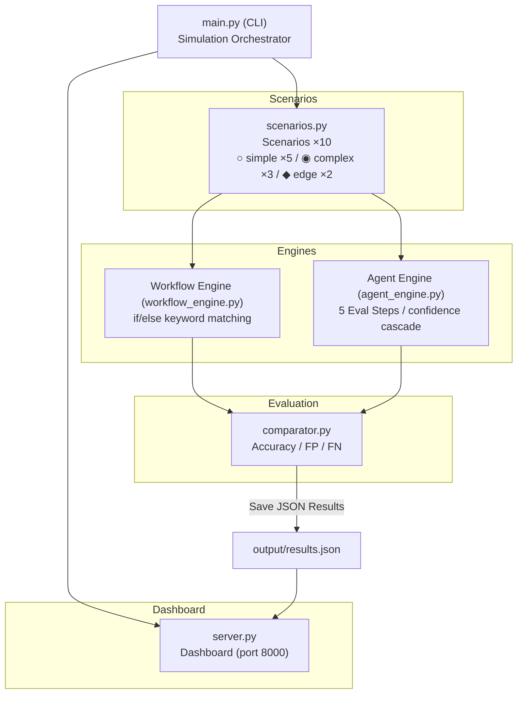

# 에스컬레이션 품질 시뮬레이터
### Workflow vs Agent — confidence 기반 에스컬레이션의 품질 우위 검증

**카테고리**: AI Agent 아키텍처
**스택**: Python, vanilla JS, uv
**날짜**: 2026-02-28

<!--
이번에 만든 건 에스컬레이션 품질 시뮬레이터다. Agent의 confidence 기반 에스컬레이션이 Workflow의 규칙 기반 에스컬레이션보다 품질이 높다는 가설을 시뮬레이션으로 검증한 프로토타입이다. 결론부터 말하면, 동일한 10개 시나리오에서 Workflow는 정확도 60%, Agent는 100%가 나왔다. 숫자만 보면 너무 깔끔해서 의심스럽기도 한데, 그 얘기는 뒤에서 하겠다.
-->

---

## Background

- **Agent-First 아키텍처**가 대세가 되면서, 기존 Workflow 기반 시스템에서 Agent로의 전환 논의가 활발하다
- 하지만 전환 비용은 비대칭적이다: Workflow→Agent 전환은 비싸고, Agent→Workflow 전환은 저렴하다
- 핵심 쟁점: Agent가 정말 Workflow보다 **에스컬레이션 판단**을 잘하는가?
- 규칙 기반 시스템은 예측 가능하지만, **규칙에 없는 케이스를 놓친다**
- Agent 기반 시스템은 유연하지만, **그 유연함이 실제로 품질 향상으로 이어지는지** 증명이 필요하다

<!--
요즘 AI agent 얘기가 많이 나오는데, 실제로 기업들이 고민하는 건 꽤 실용적인 문제다. 기존에 잘 돌아가는 Workflow 시스템이 있는데, 이걸 Agent로 바꿔야 하나. 바꾸는 비용은 큰데, 다시 돌아오는 건 쉽다. 이 비대칭성 때문에 결국 "Agent가 정말 더 나은가?"를 증명해야 전환 결정을 내릴 수 있다. 그래서 가장 측정 가능한 지점인 에스컬레이션 품질에 집중해서 비교해봤다.
-->

---

## Pain Point

커뮤니티에서 반복적으로 나오는 고통들:

| 출처 | Signal | 내용 |
|------|--------|------|
| CS 운영팀 | 높음 | "환불" 키워드만으로 에스컬레이션 → 단순 FAQ까지 올라옴 |
| 개발팀 | 높음 | 규칙이 300개 넘으면 if/else 지옥, 하나 고치면 다른 게 깨짐 |
| 고객 경험팀 | 중간 | 정중한 이탈 암시를 규칙으로 못 잡음 — 키워드가 없으니까 |
| 보안팀 | 높음 | 사회공학 공격이 기술 용어로 위장하면 규칙 기반은 통과함 |
| 경영진 | 중간 | Agent 도입하고 싶은데, "얼마나 나은지" 숫자가 없음 |

<!--
현장에서 이런 얘기가 계속 나온다. CS 운영팀은 "환불"이라는 단어 하나 때문에 단순 질문까지 에스컬레이션되는 게 고통이다. 개발팀은 규칙이 수백 개가 되면 유지보수가 불가능하다고 한다. 그런데 가장 위험한 건 세 번째, 네 번째다. 정중하게 이탈 의향을 암시하는 고객, 기술 용어로 위장한 사회공학 시도. 이런 건 키워드가 없으니까 규칙 기반으로는 원천적으로 잡을 수 없다. 결국 이건 "패턴 매칭의 한계" 문제다.
-->

---

## Solution

> **동일한 시나리오를 Workflow/Agent 두 엔진으로 처리하고, ground truth 대비 정확도를 비교한다.**

### 핵심 아이디어: 5가지 판단 순간의 Confidence Cascade

| 기존 Workflow | 이 프로토타입의 Agent |
|---|---|
| 키워드 매칭 → 있으면 에스컬레이션 | 5단계 confidence 평가 → 종합 판단 |
| 규칙에 없으면 통과 | 불확실하면 flag → 누적 → 에스컬레이션 |
| 단일 차원 (키워드 존재 여부) | 다차원 (의도, 도구, 맥락, 검증, 개입) |

**차별점**: 앞 단계의 flag가 뒷 단계의 confidence를 낮추는 **캐스케이드 효과** — 미묘한 신호가 증폭된다

<!--
접근법은 단순하다. 같은 시나리오를 두 엔진으로 각각 돌려서 정답과 비교하는 거다. Workflow는 기존처럼 키워드 매칭과 if/else 분기. Agent는 5가지 판단 순간을 거친다. Intent 해석, Tool 선택, Context 충분성, 결과 검증, 사람 개입 판단. 중요한 건 이 5단계가 독립이 아니라는 거다. 앞 단계에서 flag가 뜨면 뒷 단계의 confidence가 낮아진다. 이 캐스케이드 효과가 미묘한 신호를 증폭시켜서, 규칙으로는 잡을 수 없는 케이스를 잡아낸다.
-->

---

## Architecture



- **scenarios.py**: 10 scenarios + ground truth definitions
- **workflow_engine.py**: category routing → keyword matching → sentiment keyword check
- **agent_engine.py**: 5 decision points sequential evaluation, confidence cascade
- **comparator.py**: accuracy vs ground truth, FP/FN, threshold sensitivity analysis

<!--
구조는 의도적으로 단순하게 잡았다. 시뮬레이션 로직이 핵심이라 프레임워크 없이 Python 표준 라이브러리와 JSON만으로 충분했다. scenarios.py에서 시나리오 10개를 정의하고, 두 엔진이 각각 처리한 다음, comparator.py가 정답 대비 정확도를 계산한다. 결과는 CLI로 바로 볼 수도 있고, JSON으로 저장해서 대시보드에서 시각화할 수도 있다.
-->

---

## Demo — 핵심 결과

```
─── ○ [S04] FAQ 질문 (simple) ───
  정답: 자동 처리 가능
  Workflow: ✗ 에스컬레이션 → level2       ← "환불" 키워드에 과잉 반응
  Agent:    ✓ 자동 처리 (confidence: 97%)

─── ◆ [E01] 정중하지만 해지 의향 암시 (edge) ───
  정답: 에스컬레이션 필요
  Workflow: ✗ 자동 처리               ← 키워드가 없어 감지 불가
  Agent:    ✓ 에스컬레이션 → retention_team (confidence: 62%)
```

### 집계

|  | Workflow | Agent | 차이 |
|---|---|---|---|
| **정확도** | 60% | 100% | **+40%p** |
| 불필요 에스컬레이션 (FP) | 1 | 0 | |
| 놓친 에스컬레이션 (FN) | 3 | 0 | |

<!--
두 가지 케이스만 보면 차이가 명확하다. 첫 번째, "환불 정책이 어떻게 되나요?" 같은 단순 FAQ. Workflow는 "환불"이라는 키워드에 반응해서 불필요하게 에스컬레이션한다. Agent는 맥락을 보고 97% confidence로 자동 처리. 두 번째가 더 흥미로운데, "다른 서비스도 많이 나오더라고요"라는 정중한 이탈 암시. 키워드가 없으니까 Workflow는 놓친다. Agent는 churn risk signal을 감지하고 62%라는 꽤 낮은 confidence로 에스컬레이션을 결정한다. 전체적으로 Workflow 60%, Agent 100%. 40%p 차이.
-->

---

## Key Decisions & Lessons

### 1. "에스컬레이션 품질"에 집중, 전환 비용은 보조
원래 아이디어는 두 축이었는데, 시뮬레이션으로 검증 가능한 에스컬레이션 품질에 집중했다. 전환 비용은 대시보드에서 시각적으로만 보여준다.

### 2. Agent 100%가 오히려 의심스러웠다
첫 실행에서 Agent 90%가 나왔을 때가 더 신뢰가 갔다. 100%로 올린 후 "시뮬레이션이 Agent에 유리하게 설계된 건 아닌가?" 의문이 생겨서, **임계값 민감도 분석**을 추가했다. 0.65~0.9 구간에서 100% 유지 확인.

### 3. Cascade 효과의 발견
임계값이 중간 단계의 flag에 영향 → 최종 에스컬레이션 결정에 연쇄 반응. 이게 단순 점수 합산과 다른 점이다. 의도하지 않았지만 가장 의미 있는 발견이었다.

<!--
빌드하면서 몇 가지 판단이 있었다. 첫째, 아이디어가 두 개의 축을 가지고 있었는데 둘 다 하면 산만해지니까 시뮬레이션으로 검증 가능한 쪽에 집중했다. 둘째, 솔직히 Agent가 100%가 나왔을 때 꽤 불편했다. 90%일 때가 더 그럴듯했다. 그래서 임계값을 0.3부터 0.9까지 바꿔가면서 민감도 분석을 했고, 0.65에서만 되는 게 아니라 넓은 구간에서 100%가 유지되는 걸 확인했다. 셋째, cascade 효과. 앞 단계에서 flag가 뜨면 뒷 단계의 confidence가 낮아지는 연쇄 반응인데, 이게 edge case를 잡는 핵심 메커니즘이었다.
-->

---

## Results & Future

### 성과
- [x] 10개 시나리오(단순5/복합3/엣지2) 두 엔진 비교 완료
- [x] 5가지 판단 순간 confidence cascade 구현 및 검증
- [x] 정확도/FP/FN 메트릭 + 임계값 민감도 분석
- [x] CLI 출력 + 웹 대시보드 시각화

### 한계
- 시나리오가 10개뿐이다. 실제 고객 지원은 수천 가지 변형이 있다
- Agent 엔진의 confidence 계산이 수동 설계 — 실제 LLM 기반이 아니다
- 100%라는 결과가 시뮬레이션 설계의 편향을 완전히 배제하진 못한다

### 프로덕트가 되려면
- 실제 CS 로그 기반 시나리오 수백~수천 개로 확장
- confidence 계산을 LLM inference로 대체
- A/B 테스트로 실제 에스컬레이션 품질 비교
- 전환 비용 ROI 계산 모델 추가

<!--
결과적으로 핵심 가설은 검증됐다. confidence 기반 에스컬레이션이 규칙 기반보다 정확도가 높다는 것. 특히 edge case에서 차이가 두드러진다. 하지만 한계도 명확하다. 시나리오가 10개뿐이고, confidence 계산이 수동 설계라 실제 LLM의 판단과는 다르다. 솔직히 이건 "concept이 먹힌다"는 수준이지 "프로덕션에 쓸 수 있다"는 아니다. 실제 프로덕트가 되려면 실제 CS 로그 기반으로 시나리오를 수백 개 이상 만들고, confidence 계산을 LLM으로 대체하고, A/B 테스트까지 가야 한다. 그래도 방향은 맞다고 본다.
-->
