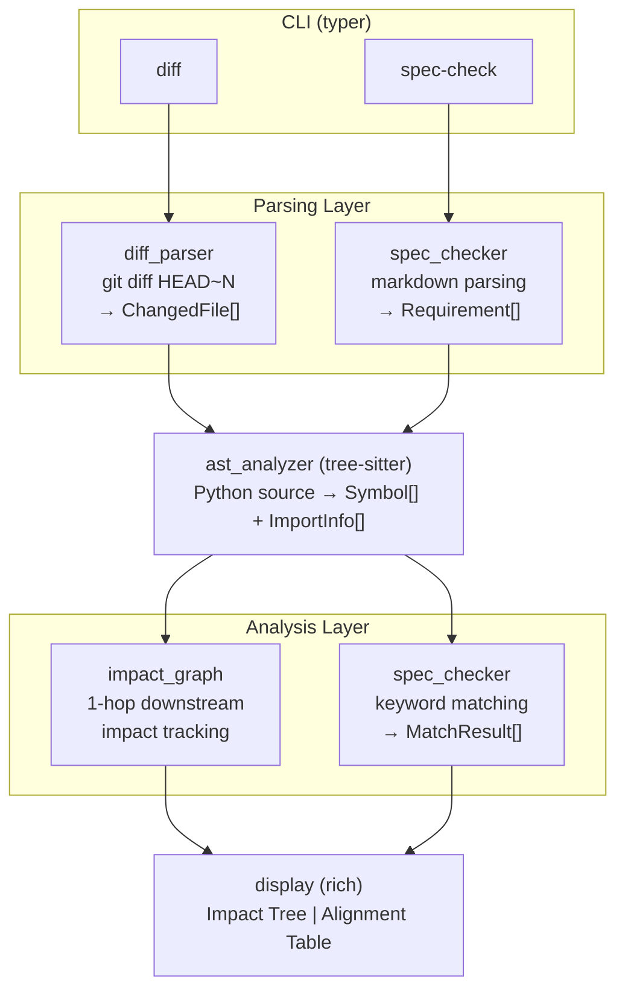

# AI 코드 변경 영향 추적기

> tree-sitter AST 파싱 + git diff 분석으로 코드 변경의 downstream 영향 범위를 추적하고, spec 문서와의 괴리를 자동 탐지하는 CLI 도구

**카테고리**: Developer Tools / Code Analysis
**스택**: Python, tree-sitter, typer, rich
**날짜**: 2026-03-01

<!--
이번에 만든 프로토타입은 AI 코드 변경 영향 추적기다. AI 코딩 도구로 코드를 바꿨을 때, 그 변경이 다른 코드에 어떤 영향을 주는지 자동으로 추적하는 CLI 도구다. tree-sitter로 AST를 파싱하고, git diff와 결합해서 변경의 파급 범위를 보여준다.
-->

---

## Background

AI 코딩 도구의 시대가 열렸다. Copilot, Claude Code, Cursor — 이제 코드를 직접 타이핑하는 것보다 AI에게 시키는 게 빠른 시대.

**그런데 문제가 하나 있다.**

- AI가 생성한 코드는 인간이 작성한 코드보다 **1.7배 많은 이슈**를 유발한다는 보고
- 한 줄 바꿨는데 **7개 기능이 깨지는** 연쇄 장애
- AI로 50번 반복 수정 후, 원래 spec/PRD가 코드 현실과 **완전히 동떨어진** 상태

코드를 빠르게 만드는 건 쉬워졌지만, **그 코드가 뭘 건드렸는지 아는 건** 여전히 어렵다.

<!--
AI 코딩 도구가 보편화되면서 코드 작성 속도는 확실히 빨라졌다. 그런데 속도가 빨라진 만큼 부작용도 빨라졌다. AI가 만든 코드가 기존 코드에 어떤 영향을 주는지, 원래 스펙과 얼마나 벌어졌는지를 개발자가 직접 추적하기가 점점 어려워지고 있다. 결국 이건 속도와 이해도 사이의 트레이드오프 문제다.
-->

---

## Pain Point

커뮤니티에서 반복적으로 나오는 고통들:

| # | 출처 | Signal | Pain Point |
|---|------|:------:|------------|
| 1 | reddit/r/selfhosted | ⭐⭐⭐⭐⭐ | 바이브코딩으로 만든 앱의 품질·보안·지속성이 심각하게 우려됨 |
| 2 | Hacker News | ⭐⭐⭐⭐ | AI 코딩 도구 과사용 시 코드 이해도 저하, **인지적 부채** 발생 |
| 3 | geeknews | ⭐⭐⭐⭐ | AI 시대에 테스트 코드 없으면 코드 안정성 유지 불가 |
| 4 | reddit/r/devtools | ⭐⭐⭐ | AI 코드 한 줄 변경이 **7개 기능을 깨뜨림** |
| 5 | reddit/r/devtools | ⭐⭐⭐ | AI 50회 반복 후 **스펙/PRD가 코드와 완전 괴리** |

공통 키워드: **"내가 뭘 바꿨는지 모르겠다"**

<!--
reddit, Hacker News, geeknews 같은 개발자 커뮤니티에서 이런 얘기가 계속 나온다. AI 코딩 도구가 좋은데, 만든 코드가 다른 코드에 어떤 영향을 주는지 모른다는 거다. 특히 "코드를 50번 고쳤더니 원래 스펙이랑 완전히 달라졌다"는 경험담이 꽤 많다. 결국 개발자가 자기 코드를 이해하지 못하는 상황이 생기는 건데, 이걸 인지적 부채라고 부른다.
-->

---

## Solution

### 접근법

> **AST 레벨에서 변경 영향을 추적하고, spec 문서와 코드 간 괴리를 자동 탐지한다**

### 기존 도구와의 차이

| 기존 | 이 도구 |
|------|---------|
| IDE의 find references → 텍스트 매칭 | **tree-sitter AST** → 구조적 심볼 매칭 |
| PR 단위 코드 리뷰 (Qodo, CodeRabbit) | **변경 심볼의 1-hop downstream** 영향 추적 |
| 코드 품질 검사에 집중 | **spec-코드 괴리** 자동 탐지 |

핵심: "단일 PR 품질 검사"가 아니라 **"변경의 파급 + 스펙과의 간극"**을 본다

<!--
기존 도구들은 대부분 단일 PR이나 커밋의 코드 품질을 검사하는 데 집중한다. blast-radius.dev 같은 도구가 downstream 영향을 보긴 하는데, 스펙과 코드 사이의 괴리를 추적하진 않는다. 이 도구는 두 가지를 동시에 한다. tree-sitter로 AST를 파싱해서 변경된 함수가 어디에 영향을 주는지 보고, 동시에 스펙 문서와 실제 구현이 얼마나 벌어졌는지도 보여준다.
-->

---

## Architecture



- **ast_analyzer**: Core engine that structurally extracts function/class/import/call relationships using tree-sitter
- **Two pipelines** (`diff`, `spec-check`) share the ast_analyzer module

<!--
아키텍처는 두 개의 파이프라인이 하나의 AST 분석 엔진을 공유하는 구조다. diff 파이프라인은 git diff를 파싱해서 변경된 파일과 라인을 뽑고, 거기에 AST 분석을 결합해서 어떤 심볼이 바뀌었는지, 그 심볼을 호출하는 downstream은 뭔지를 추적한다. spec-check 파이프라인은 markdown 스펙을 파싱해서 코드 심볼과 매칭한다. 공통 엔진을 공유하니까 모듈 6개로 꽤 깔끔하게 떨어진다.
-->

---

## Demo

### `diff` — 변경 영향 추적

```
$ uv run impact-track diff HEAD~1

📊 Code Change Impact Tree
┣── 🔧 calculate_total (function)  models.py:15-28
│   ┣── ↳ process_order (function)  services.py:10  ← calls calculate_total
│   ┗── ↳ OrderAPI.create (method)  api.py:22       ← imports and calls
┗── ⚙️ User.validate (method)      models.py:35-42
    ┗── 영향 범위 없음 (1-hop downstream 없음)
```

### `spec-check` — Spec-코드 괴리 리포트

```
$ uv run impact-track spec-check spec.md

📋 Spec-Code Alignment Report
┃ #  ┃ 요구사항       ┃ 상태     ┃ 매칭된 코드            ┃
│ 1  │ 주문 총액 계산  │ ✅ 구현됨 │ calculate_total        │
│ 2  │ 사용자 인증     │ ✅ 구현됨 │ User.validate          │
│ 3  │ 결제 처리       │ ❌ 미구현 │                        │

⚠️ 코드에만 존재 (spec에 미언급)
┣── health_check (function)  api.py:5
┗── format_response (function)  api.py:45
```

<!--
실제 실행 결과를 보면, diff 명령은 변경된 심볼과 그 downstream을 트리로 보여준다. calculate_total을 바꾸면 process_order와 OrderAPI.create가 영향을 받는다는 걸 한눈에 볼 수 있다. spec-check는 더 재미있는데, 스펙에 있는 요구사항 중 뭐가 구현됐고 뭐가 안 됐는지, 그리고 스펙에 없는데 코드에만 있는 함수가 뭔지까지 보여준다. 이게 결국 스펙과 코드의 간극이다.
-->

---

## Key Decisions & Lessons

### 기술 판단

| 판단 | 선택 | 이유 |
|------|------|------|
| AST 파서 | tree-sitter | regex나 ast 모듈 대신 — 언어 확장성 + 정확한 범위 매칭 |
| CLI 프레임워크 | typer | click 대비 코드량 절반, 타입 힌트 기반 자동 완성 |
| 의존성 수 | **4개만** | typer, tree-sitter, tree-sitter-python, rich |

### 시행착오

- `obj.method()` 패턴의 인스턴스 메서드 호출이 추적 안 되는 문제 → `_extract_calls`에서 `.` 기준 분리 로직 추가
- spec의 "제외", "기술 제약" 섹션이 요구사항으로 잘못 인식 → 섹션 헤딩 기반 skip 로직
- `--path` 지정 시 git diff 경로와 AST 경로 불일치 → git 루트 자동 감지 + 하위 디렉토리 필터링

### 심의 점수
문제 진정성 **4.3** · 프로토타입 적합성 **4.0** · 학습 가치 **4.7** · 만장일치 승인

<!--
스택 선택에서 가장 중요했던 건 tree-sitter를 쓴 거다. Python 표준 ast 모듈도 있지만, tree-sitter는 나중에 다른 언어로 확장할 수 있고, 바이트 레벨 범위 매칭이 정확하다. 시행착오 중에 인상적이었던 건 인스턴스 메서드 추적 문제다. user.validate_email() 같은 호출이 처음에 안 잡혔는데, 호출 추출 로직에서 점(.) 기준으로 분리해서 메서드명만 따로 매칭하는 식으로 해결했다. 의존성을 4개만 쓴 것도 의도적인 판단이다. 프로토타입은 가벼워야 한다.
-->

---

## Results & Future

### 성과

- [x] `diff HEAD~N` — 변경 심볼 + 1-hop downstream 트리 출력
- [x] `spec-check` — 구현됨/미구현/괴리 상태 리포트
- [x] 실제 Python 프로젝트에서 의미 있는 결과 출력
- [x] tree-sitter AST 파싱 + import/호출 관계 정확 추출
- **4/4 완료 기준 통과 → SUCCESS**

### 한계

- Python 프로젝트만 지원 (tree-sitter-python만 사용)
- 1-hop downstream만 추적 (N-hop 미지원)
- spec 매칭이 키워드 기반 (시맨틱 매칭 아님)

### 프로덕트가 되려면

- 다중 언어 지원 (TypeScript, Go 등 tree-sitter 그래머 추가)
- N-hop 영향 추적 + 영향도 점수
- LLM 기반 시맨틱 spec 매칭
- CI 파이프라인 통합 (PR마다 자동 리포트)

<!--
완료 기준 4개를 다 통과했다. 솔직히 한계는 있다. Python만 지원하고, 1-hop까지만 추적하고, spec 매칭도 키워드 기반이라 정교하지 않다. 그런데 프로토타입으로서 검증하고 싶었던 건 "tree-sitter AST 파싱과 git diff를 결합하면 의미 있는 변경 영향 분석이 되는가"였고, 그건 확인됐다. 실제 프로덕트가 되려면 다중 언어 지원이랑 LLM 기반 시맨틱 매칭이 필요한데, 그건 이 구조 위에 얹을 수 있는 문제다.
-->
