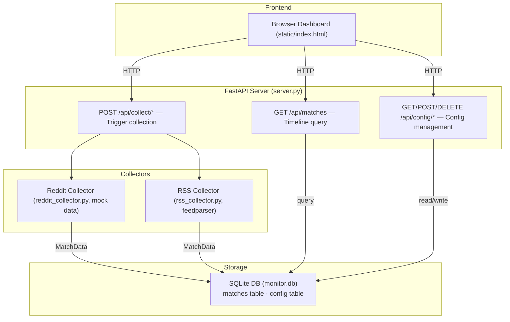

# Community Keyword Monitor

> 멀티플랫폼 커뮤니티(Reddit, RSS)에서 키워드를 모니터링하고
> 통합 타임라인으로 확인하는 셀프호스팅 대시보드

**카테고리**: Developer Productivity / Community Intelligence
**스택**: Python · FastAPI · SQLite · feedparser · vanilla JS
**날짜**: 2026-03-14

<!--
이 프로토타입은 개발자들이 매일 수동으로 커뮤니티를 돌아다니면서 키워드를 추적하는 문제를 다룬다.
Reddit, RSS 같은 멀티플랫폼 소스를 하나의 타임라인으로 합치는 게 핵심이다.
오늘은 왜 이걸 만들었고, 어떻게 동작하는지, 그리고 여기서 뭘 배웠는지를 공유하겠다.
-->

---

## Background

개발자, 인디해커, OSS 메인테이너는 수십 개의 커뮤니티 채널을 매일 확인한다.
Reddit, Hacker News, Discord, Telegram, RSS — 플랫폼이 분산되어 있고, 각각 다른 UI에서 수동으로 키워드를 추적해야 한다.

**왜 지금 이슈인가?**

- 커뮤니티 채널 수가 계속 늘어나고 있다 (Discord 서버, subreddit, RSS 피드...)
- 기존 모니터링 도구는 **엔터프라이즈 가격** — Brand24(월 $79+), Mention, Devi AI
- 무료로 멀티플랫폼을 통합 모니터링할 수 있는 셀프호스팅 도구가 없다
- 하루 30분 이상을 수동 모니터링에 쓰는 건 비효율의 영역이다

<!--
개발자 생태계에서 커뮤니티는 꽤 중요한 채널이다. 제품 피드백도 거기서 나오고, 트렌드도 거기서 잡힌다.
문제는 이 채널이 너무 분산되어 있다는 거다. Reddit 따로, HN 따로, Discord 따로.
매일 이걸 돌아다니면서 키워드를 눈으로 찾는 건, 결국 사람이 검색 엔진 역할을 하는 셈이다.
기존 솔루션은 있는데 Brand24 같은 건 월 79달러부터 시작한다. 인디해커한테는 부담스러운 가격이다.
-->

---

## Pain Point

커뮤니티에서 실제로 관찰되는 고통들:

| # | 출처 | Signal | Pain Point |
|---|------|:------:|------------|
| 1 | r/SideProject | ●●● | 여러 커뮤니티(Discord, Reddit, Telegram)에서 키워드를 수동 모니터링하면 매일 **수시간 소요** |
| 2 | GitHub Trending | ●●● | 다양한 플랫폼의 트렌드를 수동 모니터링하면 **정보 과부하** 발생, 중요 신호를 놓침 |
| 3 | Hacker News | ●●● | OSS 메인테이너가 반복 관리 작업에 **과도한 시간**을 소비 |

**공통 패턴**: 정보는 분산되어 있고, 사람이 통합하고 있다.

<!--
세 군데서 비슷한 신호가 나온다. SideProject 서브레딧에서는 수동 모니터링에 수시간을 쓴다는 얘기가 나오고, GitHub Trending 쪽에서는 정보 과부하 문제가 나온다.
결국 공통 패턴은 하나다. 정보는 여기저기 흩어져 있는데, 그걸 합치는 건 사람이 하고 있다.
사람이 검색 엔진과 필터를 겸하고 있는 셈인데, 이건 자동화할 수 있는 영역이다.
-->

---

## Solution

**한 줄 요약**: 멀티플랫폼 키워드 수집 → 노이즈 필터링 → 통합 타임라인

### 기존 솔루션과의 차이

| | Brand24 / Mention | TrendRadar (OSS) | **이 프로토타입** |
|---|---|---|---|
| 가격 | 월 $79+ | 무료 | 무료 (셀프호스팅) |
| 플랫폼 | 소셜 미디어 중심 | 핫이슈 집계 | Reddit + RSS 통합 |
| 노이즈 필터링 | 있음 | 없음 | upvote/score 임계값 |
| 키워드 커스터마이징 | 있음 | 제한적 | UI에서 자유롭게 추가/삭제 |
| 셀프호스팅 | 불가 | 가능 | 가능 (uv run 한 줄) |

<!--
접근법은 단순하다. 여러 플랫폼에서 키워드를 수집하고, 노이즈를 걸러내고, 하나의 타임라인으로 보여준다.
기존에 Brand24 같은 SaaS가 있긴 한데 월 79달러다. TrendRadar라는 오픈소스도 있는데 실시간 키워드 매칭은 안 된다.
이 프로토타입의 포인트는 무료 셀프호스팅이면서, 노이즈 필터링까지 되는 거다.
uv run 한 줄이면 돌아간다.
-->

---

## Architecture



- **server.py**: 7 FastAPI endpoints, also serves static files
- **reddit_collector.py**: Generates mock data (no API key required)
- **rss_collector.py**: Parses real RSS feeds with feedparser
- **db.py**: SQLite WAL mode, deduplication via `INSERT OR IGNORE`

<!--
구조는 의도적으로 단순하게 잡았다. FastAPI 서버 하나가 API와 정적 파일 서빙을 다 처리한다.
수집기는 두 개다. Reddit은 API 키가 필요해서 mock으로 대체했고, RSS는 feedparser로 실제 피드를 파싱한다.
DB는 SQLite인데, URL을 UNIQUE로 잡아서 중복 수집을 방지한다.
전체 파일이 6개밖에 안 되는데, 프로토타입에서 구조가 복잡해지면 그건 스코프를 잘못 잡은 거다.
-->

---

## Demo

### 수집 결과

```bash
$ curl -X POST http://127.0.0.1:8765/api/collect/all
{"reddit": {"collected": 12, "source": "reddit (mock)"},
 "rss":    {"collected": 5,  "source": "rss"}}
```

→ Reddit에서 60건, RSS에서 19건 수집 (누적 기준)

### 노이즈 필터링

```bash
$ curl "http://127.0.0.1:8765/api/matches?min_score=100"
```

→ 전체 79건 중 **51건으로 필터링** — score 100 미만 노이즈 제거

### 설정 관리

```bash
$ curl -X POST "http://127.0.0.1:8765/api/config/keyword?value=rust"
{"status": "added", "key": "keyword", "value": "rust"}
```

→ UI에서도 키워드, subreddit, RSS feed 추가/삭제 가능

<!--
데모를 보면, collect/all을 호출하면 Reddit과 RSS에서 동시에 데이터를 수집한다. 누적으로 79건 정도 모인다.
여기서 min_score=100을 걸면 51건으로 줄어든다. 이게 노이즈 필터링이다. Reddit의 upvote 수가 낮은 건 걸러진다.
설정도 API로 관리할 수 있어서, 새 키워드나 피드를 런타임에 추가할 수 있다. 재시작 없이.
-->

---

## Key Decisions & Lessons

### 기술 판단

| 결정 | 선택 | 이유 |
|------|------|------|
| Reddit 연동 | mock/stub | API 키 필요 → 프로토타입에서 외부 의존성 최소화 |
| RSS 연동 | feedparser 실제 파싱 | API 키 불필요 → 실데이터로 검증 가치 있음 |
| DB | sqlite3 표준라이브러리 | 추가 의존성 0, WAL 모드로 동시성 확보 |
| 프론트엔드 | vanilla JS 단일 HTML | spec 제약 + innerHTML 대신 DOM API (XSS 방지) |

### 시행착오

- `innerHTML` 사용 시 security hook에서 XSS 경고 → **DOM API(createElement, textContent)로 전면 교체**
- RSS snippet에 HTML 태그 잔류 → `re.sub`로 태그 제거 후 재수집
- `cursor.total_changes` 부정확 → `cursor.rowcount`로 교체

### 심의 점수

문제 진정성 **3.3**/5 · 프로토타입 적합성 **3.0**/5 · 신선도 **2.7**/5 · 학습 가치 **2.7**/5

> 반대 의견: "기술적으로 비자명한 도전이 부족하며, 잘 알려진 패턴의 조합에 그침" — 준혁

<!--
주요 기술 판단을 몇 가지 짚으면, Reddit은 mock으로 갔다. API 키를 받아서 실제 연동하는 게 더 좋겠지만, 프로토타입에서 외부 의존성을 늘리면 검증 포인트가 흐려진다.
반면 RSS는 실제 파싱을 했다. feedparser가 API 키 없이 바로 쓸 수 있어서, 적어도 한 쪽은 실데이터로 검증하고 싶었다.
시행착오 중에 innerHTML XSS 이슈가 있었는데, 이건 security hook이 잡아줬다. DOM API로 전면 교체했다.
솔직히 심의에서 신선도 점수가 낮았다. 준혁이 말한 대로 기술적으로 비자명한 도전은 부족하다. 그건 인정한다.
-->

---

## Results & Future

### 성과 요약

- [x] Reddit 키워드 매칭 → SQLite 저장 (60건)
- [x] RSS 피드 키워드 매칭 → 동일 DB 저장 (19건)
- [x] 통합 타임라인에서 두 소스 시간순 통합 표시
- [x] 노이즈 필터링: min_score 적용 시 79 → 51건
- [x] 키워드/소스 추가·제거 API + UI

**5/5 완료 기준 통과 → SUCCESS**

### 한계점

- Reddit이 mock 데이터 — 실제 API 연동 시 rate limit, 인증 처리 필요
- 알림 기능 없음 — 대시보드를 직접 열어봐야 함
- 스케줄링 없음 — 수동 트리거 방식

### 프로덕트가 되려면

1. **실제 Reddit/Discord/Telegram 연동** + OAuth 인증 흐름
2. **정기 스케줄링** (cron 또는 APScheduler) + Slack/이메일 알림
3. **의미 기반 매칭** — 키워드 exact match → embedding 유사도 검색
4. **Docker 패키징** — 셀프호스팅 진입장벽 낮추기

<!--
결과적으로 완료 기준 5개 모두 통과했다. 멀티플랫폼 수집, 통합 타임라인, 노이즈 필터링, 설정 관리까지 다 동작한다.
솔직히 아쉬운 부분은 있다. Reddit이 mock이라 실제 데이터로의 검증은 안 된 거고, 알림이 없어서 대시보드를 직접 열어봐야 한다.
프로덕트로 가려면 제일 중요한 건 두 가지다. 하나는 실제 플랫폼 API 연동이고, 다른 하나는 키워드 매칭 방식이다.
지금은 exact match인데, embedding 기반으로 가면 "Python 대안" 같은 검색어로도 관련 글을 잡을 수 있다.
그게 되면 모니터링 도구가 아니라 인텔리전스 도구가 된다.
-->
