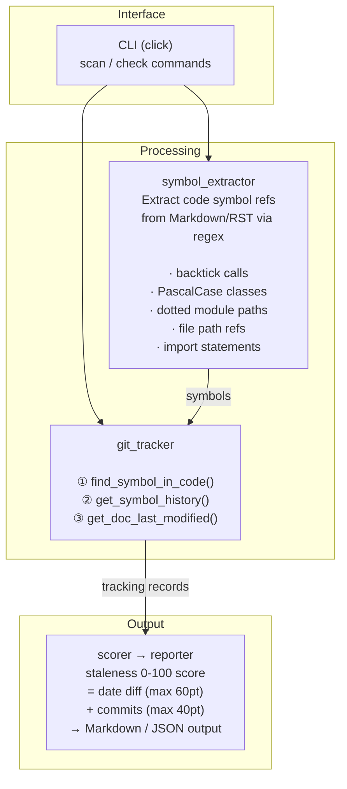

# Doc Freshness Monitor

> 코드 심볼 참조 기반으로 문서의 staleness를 감지하는 CLI 도구

**카테고리**: Developer Tooling · Documentation Quality
**스택**: Python, uv, click, git subprocess
**날짜**: 2026-03-15

<!--
기술 문서가 구식이 되는 건 누구나 아는 문제다. 그런데 "어떤 문서가 구식인지"를 정량적으로 알려주는 도구는 거의 없다. 이 프로토타입은 문서 안에 있는 코드 심볼을 추적해서, 코드가 바뀌었는데 문서는 안 바뀐 상태를 자동으로 감지한다. 오늘 그 과정과 결과를 공유하려고 한다.
-->

---

## Background

기술 문서의 근본적인 딜레마가 있다.

- **문서를 쓰면 즉시 구식이 되고, 안 쓰면 아예 없다**
- 함수 시그니처, API 엔드포인트, 설정 옵션이 바뀌어도 README는 6개월 전 상태
- 새 팀원이 구식 문서를 믿고 디버깅에 반나절을 낭비하는 패턴이 반복된다
- AI가 아키텍처 문서를 자동 생성하지만, 코드 변경 시 정합성은 검증하지 않는다

**핵심**: 문서화의 문제는 "쓰기"가 아니라 "유지"에 있다.

<!--
문서화에 대해서 얘기할 때 보통 "문서를 잘 쓰는 법"을 이야기한다. 근데 진짜 문제는 쓰기가 아니라 유지다. 코드는 매일 바뀌는데 문서는 멈춰 있다. 사람으로 치면, 지도 앱은 매일 업데이트되는데 종이 지도를 들고 다니는 것과 마찬가지다. 특히 요즘 AI가 문서를 자동으로 생성해주면서 양은 늘었는데, 그 문서가 여전히 유효한지 아무도 확인 안 한다.
-->

---

## Pain Point

커뮤니티에서 반복적으로 등장하는 고통들:

| # | 출처 | Signal | Pain Point |
|---|------|:------:|------------|
| 1 | HN | ★★★ | 코드 문서화에 시간을 투자해도 즉시 구식이 되거나, 아예 없는 상태가 반복 |
| 2 | HN | ★★★ | AI가 C4 아키텍처 문서를 생성하지만 drift가 발생하여 신뢰 불가 |
| 3 | r/MachineLearning | ★★ | ML 시스템 아키텍처를 어떻게 문서화해야 하는지 업계 표준 부재 |

공통점: **"문서가 있긴 한데 믿을 수가 없다"**

<!--
Hacker News나 Reddit을 보면 이 얘기가 계속 나온다. 문서를 열심히 썼는데 3개월 뒤에 보면 이미 코드랑 안 맞는다는 거다. AI가 문서를 생성해줘도 마찬가지다. 결국 문제의 본질은 "문서가 있다"가 아니라 "이 문서가 지금도 유효한가"를 모른다는 것이다. 특히 signal strength가 3인 pain point가 두 개나 된다는 건, 이 문제를 꽤 많은 사람이 겪고 있다는 의미다.
-->

---

## Solution

**접근법**: 문서 안의 코드 심볼 참조를 추출하고, git log로 해당 코드의 변경 이력을 추적하여 staleness score를 산출한다.

### 기존 솔루션과의 차이

| | Ferndesk | DeepDocs | **Doc Freshness Monitor** |
|---|---|---|---|
| 대상 | 고객 대면 API 문서 | PR 단위 diff | **내부 기술 문서 전체** |
| 방식 | 지원 티켓 분석 | PR diff 스캔 | **코드 심볼 참조 매핑** |
| 범위 | 외부 문서 | PR별 | **전체 코드베이스** |
| 출력 | 알림 | PR 코멘트 | **정량 staleness score** |

**핵심 차별점**: 심볼 수준의 참조 매핑 + 정량 스코어링 + CI 통합

<!--
기존 도구들은 주로 고객용 API 문서를 대상으로 하거나, PR이 올라올 때만 동작한다. 근데 실제로 구식이 되는 건 내부 아키텍처 문서나 README 같은 것들이다. 이 도구는 좀 다르게 접근한다. 문서에 있는 코드 심볼, 예를 들어 함수명이나 클래스명을 추출한 다음에, git log로 그 코드가 마지막으로 언제 바뀌었는지 추적한다. 그래서 "이 문서가 참조하는 코드가 문서 작성 이후에 바뀌었다"는 걸 숫자로 보여준다.
-->

---

## Architecture



<!--
구조는 꽤 단순하다. 네 개의 모듈이 파이프라인으로 연결된다. symbol_extractor가 문서에서 정규식으로 코드 심볼을 뽑아내고, git_tracker가 그 심볼이 실제 코드 어디에 있는지 git grep으로 찾은 다음 git log로 변경 이력을 수집한다. scorer가 날짜 차이랑 커밋 수를 조합해서 0에서 100 사이의 staleness score를 계산하고, reporter가 마크다운이나 JSON으로 결과를 출력한다. gitpython 같은 무거운 라이브러리 대신 subprocess로 git을 직접 호출했다.
-->

---

## Demo

**httpx 프로젝트에서 실행한 결과:**

```
$ uv run doc-freshness check ./httpx --threshold 50

Scanning docs in /home/user/httpx...
Found 314 symbol references in doc files.
Tracking symbol changes via git log...

# Doc Freshness Report

| Score    | Doc File    | Symbol        | Kind     | Code Last Changed |
|---------:|:------------|:--------------|:---------|:------------------|
| **93** ⚠️ | docs/api.md | `close`       | function | 2026-03-10        |
| **72** ⚠️ | docs/api.md | `to_markdown` | function | 2026-03-08        |
|   ...    |   ...       |   ...         |   ...    |   ...             |

⚠ 11 doc-symbol pair(s) exceed staleness threshold (50)
```

Flask에서도 **40건**의 stale 경고 감지 — `redirect`, `url_for` 등 핵심 함수 포함.

<!--
실제로 httpx와 Flask 두 개의 오픈소스 프로젝트에서 돌려봤다. httpx에서는 314개의 심볼 참조를 추출했고, 그 중 11건이 threshold 50을 넘겼다. close 함수가 93점으로 가장 높았는데, 코드는 계속 바뀌고 있는데 문서는 꽤 오래 전에 마지막으로 수정된 케이스다. Flask에서는 40건이 나왔다. redirect나 url_for 같은 핵심 함수들이 포함되어 있어서, 실제로 의미 있는 경고라고 판단했다.
-->

---

## Key Decisions & Lessons

### 기술 판단

| 결정 | 선택 | 이유 |
|------|------|------|
| Git 라이브러리 | subprocess 직접 호출 | gitpython은 무거움. subprocess로 충분 |
| 심볼 추출 | 정규식 기반 | tree-sitter는 과도. 백틱 참조 + PascalCase로 충분한 커버리지 |
| RST 지원 | Phase 2에서 추가 | Flask 스캔 시 .rst 미지원으로 결과 누락 발견 |

### 시행착오

- **코드 블록 내부 심볼**: 처음에 마크다운 코드 블록 안의 심볼까지 추출됨 → `in_code_block` 상태 추적 추가
- **False positive**: `g`, `it` 같은 1-2글자 토큰이 심볼로 잡힘 → `MIN_SYMBOL_LEN` + `GENERIC_SYMBOLS` 필터 추가

### 심의 점수
문제 진정성 **4.3**/5 · 프로토타입 적합성 **4.0**/5 · 신선도 **3.0**/5 · 학습 가치 **3.7**/5

<!--
몇 가지 판단이 있었다. 먼저 gitpython 대신 subprocess를 선택한 건, 프로토타입 단계에서 의존성을 최소화하고 싶었기 때문이다. 심볼 추출도 tree-sitter까지 갈 필요 없이 정규식으로 충분했다. 백틱으로 감싼 함수명이나 PascalCase 클래스명만 잡아도 커버리지가 꽤 나온다. 시행착오가 두 가지 있었는데, 코드 블록 안에 있는 심볼까지 뽑히는 문제랑 짧은 토큰의 false positive 문제였다. 둘 다 필터링으로 해결했다. 신선도 점수가 3.0인 건, 솔직히 유사한 학술 연구가 이미 있기 때문이다. 다만 "실용적 CLI 도구"로서의 접근은 차별점으로 인정받았다.
-->

---

## Results & Future

### 성과 요약 — 5/5 완료 기준 통과

- ✅ `scan` 명령 — 매핑 테이블 출력 (httpx: 314개 심볼)
- ✅ staleness score 0-100 산출 — 날짜 차이 + 커밋 수 반영
- ✅ `--threshold` 임계치 초과 시 exit code 1 반환
- ✅ JSON / Markdown 리포트 생성
- ✅ 오픈소스에서 의미 있는 stale 경고 확인 (httpx: 11건, Flask: 40건)

### 한계와 확장 방향

| 한계 | 확장 방향 |
|------|-----------|
| Python만 지원 | 다중 언어 심볼 추출 (Go, JS, Rust) |
| 정규식 기반 추출 | tree-sitter 기반 정확한 심볼 매핑 |
| CLI만 | GitHub Actions 플러그인 + PR 코멘트 |
| 심볼 존재 여부만 | 코드 스니펫과 실제 코드 diff 비교 |

### 프로덕트가 되려면?
CI 파이프라인 통합 패키징, 다중 언어 지원, 그리고 "이 문서 어떻게 고치면 되는지"까지 제안하는 AI 자동 수정 기능이 필요하다.

<!--
5개 완료 기준을 다 통과했다. 솔직히 이건 좀 아쉬운 부분인데, Python만 지원한다는 게 가장 큰 한계다. 실제 프로젝트는 여러 언어가 섞여 있으니까. 그리고 정규식 기반 추출은 간단하지만 정확도에 한계가 있다. 프로덕트로 가려면 세 가지가 필요하다. 하나는 GitHub Actions 같은 CI에 플러그인으로 들어가야 하고, 둘은 다중 언어를 지원해야 하고, 셋은 그냥 "구식이다"라고 알려주는 것에서 "이렇게 고쳐라"까지 제안할 수 있어야 한다. 결국 문서 유지의 문제는 감지에서 끝나는 게 아니라 수정까지 자동화되어야 의미가 있다.
-->
