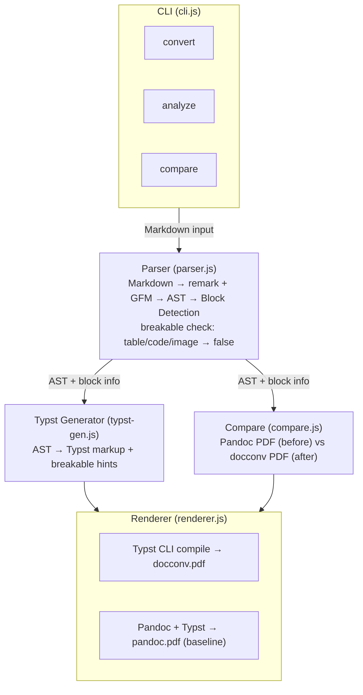

# 구조 인식 문서-PDF 변환 도구

**Markdown → PDF 변환 시 표와 코드 블록이 페이지 중간에서 잘리지 않게.**

- 카테고리: Developer Tools / Document Processing
- 스택: Node.js, remark/unified, Typst
- 날짜: 2026-03-03

<!--
문서를 PDF로 변환하는 건 개발자들이 매일 하는 일이다. 그런데 변환 결과물을 열어보면, 표가 반으로 잘려 있거나 코드 블록이 두 페이지에 걸쳐 있는 경우가 꽤 많다. 오늘 이 프로토타입은 그 문제를 AST 레벨에서 해결하는 도구다. doc-structure-converter.
-->

---

## Background

문서 변환은 오래된 문제다.
하지만 "변환 품질"의 기준이 바뀌고 있다.

- Notion, Obsidian 같은 도구에서 PDF 내보내기 수요가 급증
- 기술 문서, 학습 자료, 발표 자료로 PDF를 공유하는 빈도가 높아짐
- 기존 도구(Pandoc, 브라우저 인쇄)는 **텍스트 변환**에 집중
  → 블록 단위 레이아웃은 신경 쓰지 않음

**결국 이건 "텍스트는 변환되는데 구조는 파괴되는" 문제다.**

<!--
문서를 PDF로 만드는 도구는 이미 많다. Pandoc도 있고, 브라우저에서 인쇄 버튼을 눌러도 된다. 그런데 이 도구들의 공통점이 있다. 텍스트를 변환하는 데는 충실한데, 문서의 구조, 그러니까 표가 어디서 시작하고 끝나는지, 코드 블록이 하나의 덩어리인지는 신경을 안 쓴다는 거다. 결국 이건 텍스트 변환과 구조 보존이 분리되어 있는 문제다.
-->

---

## Pain Point

커뮤니티에서 실제로 나온 불만들:

| # | 출처 | Signal | Pain Point |
|---|------|--------|------------|
| 1 | GeekNews | ★★★ | 노션 문서를 PDF로 내보낼 때 페이지가 중간에서 잘리는 문제 |
| 2 | Hacker News | ★★★★ | 다국어 혼합 텍스트를 업계 표준 PDF로 변환하는 워크플로가 없다 |
| 3 | Hacker News | ★★★ | STEM 노트 OCR 시 수식의 정렬·구조가 깨져서 의미가 손실된다 |

세 문제의 공통 원인:
**블록 레벨 구조를 인식하지 않고 변환하는 것.**

<!--
이게 그냥 있으면 좋겠다 수준의 문제가 아니다. GeekNews에서도, Hacker News에서도 같은 얘기가 반복된다. 노션에서 PDF 뽑았는데 표가 잘렸다, 코드 블록이 두 페이지에 걸쳐 있어서 읽을 수가 없다. 흥미로운 건 다국어 조판 문제, 수학 OCR 문제도 결국 같은 뿌리다. 문서의 블록 구조를 모르고 변환하니까 깨지는 거다.
-->

---

## Solution

**한 줄 요약**: Markdown을 AST로 파싱하고, 표·코드·이미지 블록에 "여기서 자르지 마" 힌트를 붙여 PDF를 생성한다.

### 기존 도구와의 차이

| | Pandoc | PDFtion | **docconv** |
|---|---|---|---|
| 블록 구조 인식 | ✗ | 부분적 | **AST 레벨** |
| 페이지 분할 제어 | ✗ | ✗ | **breakable 힌트** |
| 입력 형식 | 다양 | Notion만 | Markdown |
| 오픈소스 | ✓ | ✗ | **✓** |

핵심: 기존 도구에 없는 **"블록 구조 분석"이라는 중간 레이어**를 넣었다.

<!--
접근법 자체는 단순하다. Markdown을 그냥 텍스트로 보지 않고, AST로 파싱해서 블록 단위로 나눈다. 그리고 표, 코드 블록, 이미지는 "이건 하나의 덩어리다, 중간에서 자르면 안 된다"는 힌트를 붙인다. 기존 도구들은 이 중간 레이어가 없다. Pandoc은 텍스트를 잘 변환하지만 블록 구조는 모르고, PDFtion은 Notion에만 붙어 있다. 결국 AST 레벨에서 구조를 인식하는 게 차별점이다.
-->

---

## Architecture



<!--
파이프라인은 네 단계다. 먼저 Parser가 Markdown을 remark로 AST로 파싱하고, 각 블록이 잘라도 되는지 판정한다. 표, 코드, 이미지는 잘라선 안 되는 블록으로 분류된다. 그 다음 Typst Generator가 이 정보를 Typst 마크업의 breakable false 힌트로 변환한다. 마지막으로 Renderer가 Typst CLI를 호출해서 PDF를 만든다. Compare 모드에서는 같은 문서를 Pandoc으로도 변환해서 비교할 수 있게 했다.
-->

---

## Demo

### 문서 분석

```
$ node src/cli.js analyze test-data/sample.md

Total blocks: 22
  Tables:      4
  Code blocks: 5
  Unbreakable: 9

Block sequence:
  1.    heading
  2.    paragraph
  3. 🔒 table       ← 페이지 경계에서 보호
  4.    paragraph
  5. 🔒 code        ← 페이지 경계에서 보호
```

### Before/After 비교 결과

| | Pandoc (기존) | docconv (우리) |
|---|---|---|
| 페이지 수 | 7 | 6 |
| 블록 중간 분할 | **4건** | **0건** |

<!--
실제로 돌려보면 이렇다. 표 4개, 코드 블록 5개가 포함된 테스트 문서를 넣으면, 9개의 블록이 unbreakable로 판정된다. 그리고 같은 문서를 Pandoc으로 변환하면 7페이지가 나오는데 코드 블록이 4군데서 잘린다. docconv로 변환하면 6페이지, 잘리는 건 0건이다. 페이지가 오히려 줄어든 건, 불필요한 빈 공간 없이 블록 단위로 페이지를 넘기기 때문이다.
-->

---

## Key Decisions & Lessons

### 기술 판단

1. **Typst를 렌더링 엔진으로 선택한 이유**
   `block(breakable: false)` — 이 한 줄이 핵심 기능을 가능하게 함.
   LaTeX에서는 같은 걸 하려면 `minipage` + 수동 계산이 필요하다.

2. **remark + GFM 플러그인 조합**
   처음에 remark-parse만 썼더니 테이블이 0개로 감지됨.
   GFM 테이블은 별도 플러그인이 필요하다는 걸 놓쳤던 것.

3. **코드 블록 이스케이프 버그**
   `__init__`이 `\_\_init\_\_`로 출력되는 문제 발견.
   raw block 내부에는 이스케이프가 불필요하다는 걸 셀프 크리틱에서 잡음.

### 심의 점수

| 항목 | 점수 |
|---|---|
| 문제 진정성 | 3.7/5 |
| 프로토타입 적합성 | 4.0/5 |
| 신선도 | 3.0/5 |
| 학습 가치 | 3.7/5 |

<!--
기술 판단에서 가장 중요했던 건 렌더링 엔진 선택이다. Typst를 고른 이유는 단순하다. breakable false라는 속성이 있다. 이게 이 프로토타입의 핵심 메커니즘 전부다. LaTeX에서 같은 걸 하려면 minipage로 감싸고 높이를 계산해야 하는데, Typst는 선언적으로 처리된다. 시행착오도 있었다. remark-parse가 GFM 테이블을 기본으로 지원하지 않는다는 걸 몰라서 테이블이 0개로 나왔던 적이 있고, 코드 블록 안의 underscore가 이스케이프되는 버그도 셀프 크리틱 과정에서 발견했다.
-->

---

## Results & Future

### 성과 요약
- 완료 기준 **5/5 통과**
- Pandoc 대비 블록 분할 **4건 → 0건** (100% 제거)
- CLI 세 가지 모드 모두 정상 동작 (convert, analyze, compare)

### 한계점
- Markdown만 지원 (HTML, Notion 내보내기 미지원)
- 다국어 폰트 자동 매칭 미구현 (Typst 기본 폰트에 의존)
- 블록이 한 페이지보다 클 경우의 폴백 전략 없음

### 프로덕트가 되려면
- 다양한 입력 형식 지원 (HTML, Notion API, Confluence)
- 커스텀 스타일링/테마
- 블록 크기가 한 페이지를 초과할 때의 "지능적 분할" 로직
- VS Code / Obsidian 플러그인으로 배포

<!--
완료 기준은 다 통과했다. 솔직히 스코프를 잘 잡은 덕이 크다. 다국어, 수학 OCR까지 넣었으면 아마 이 자리에 서지 못했을 거다. 한계는 명확하다. Markdown만 된다는 것, 그리고 블록 하나가 한 페이지보다 큰 경우에 대한 처리가 없다는 것. 프로덕트로 가려면 입력 형식을 넓히고, 에디터 플러그인 형태로 배포하는 게 자연스러운 다음 단계다. 핵심 가설, 그러니까 AST 레벨에서 블록 구조를 인식하면 페이지 분할 품질이 확실히 좋아진다는 건 검증됐다.
-->
