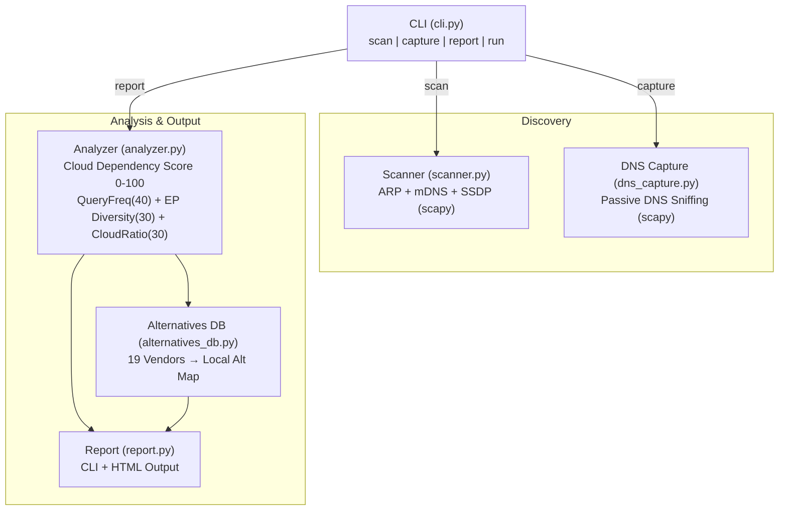

# IoT Cloud Dependency Scanner

**홈 네트워크의 IoT 기기를 자동 발견하고, 클라우드 의존도를 정량화하여 로컬 대안을 제시하는 진단 도구**

- Category: Network Security / Self-hosted
- Stack: Python, scapy, uv
- Date: 2026-03-16

<!--
요즘 스마트홈 기기를 하나도 안 쓰는 집이 거의 없다. 그런데 이 기기들이 제조사 클라우드에 얼마나 의존하는지는 아무도 모른다. 이 프로토타입은 그 의존도를 정량화하고, 로컬로 대체할 수 있는 방법을 알려주는 도구다. 네트워크 스캔부터 리포트까지 한 번에 돌아간다.
-->

---

## Background

IoT 기기가 제조사 클라우드에 **전적으로** 의존하는 구조가 만들어낸 문제들:

- 제조사가 서비스를 종료하면 기기가 **전자폐기물**이 된다
  - 커넥티드카 앱 일방 종료 → 원격 제어 불가
- 음성 비서가 **광고를 추천**하고 음성 데이터를 클라우드로 전송
- Matter 프로토콜조차 **커미셔닝에 인터넷이 필요**

Home Assistant 같은 셀프호스팅 대안은 있지만,
"내 네트워크에 클라우드 의존적 기기가 **몇 개**나 있고, **어떤 데이터**를 보내는지" 진단하는 도구가 없다.

<!--
스마트홈이 편하긴 한데, 결국 이건 소유권 문제다. 내가 산 기기인데, 제조사 서버가 꺼지면 벽돌이 된다. 최근에 자동차 제조사가 커넥티드카 앱을 일방적으로 종료한 사례가 있었다. 차는 멀쩡한데 원격 시동이 안 걸린다. Alexa는 광고를 끼워넣기 시작했고, 음성 데이터는 클라우드로 간다. 셀프호스팅 대안이 있긴 한데, 문제는 마이그레이션의 첫 단계가 없다는 거다. 내 네트워크에 뭐가 있고, 얼마나 위험한지 파악하는 것부터가 안 된다.
-->

---

## Pain Point

커뮤니티에서 반복적으로 나오는 목소리:

| 출처 | Signal | Pain Point |
|------|:------:|------------|
| Hacker News | 3/3 | 커넥티드카 앱 일방 종료 → 차량 소유자의 원격 제어 기능 상실 |
| r/selfhosted | 3/3 | Alexa가 광고 추천 + 음성 데이터 클라우드 전송, 셀프호스팅 대안은 구축이 복잡 |
| r/selfhosted | 3/3 | IoT 기기가 클라우드 의존, 서비스 종료 시 전자폐기물화. Matter조차 인터넷 필요 |

**공통 패턴**: "위험한 건 아는데, 어디서부터 시작해야 할지 모르겠다"

<!--
이 세 가지 pain point는 전부 signal strength가 3으로 꽤 강하다. 흥미로운 건 사람들이 문제를 인지하고 있다는 점이다. 클라우드 의존이 위험하다는 건 다 안다. 그런데 막상 뭘 해야 하는지 모른다. Home Assistant를 깔아야 하는 건 알겠는데, 내 집에 기기가 몇 개 있고, 어떤 게 위험한지부터 파악이 안 되니까. 결국 이건 진단 부재 문제다.
-->

---

## Solution

> **네트워크를 스캔하고, DNS 트래픽을 분석하고, 의존도를 점수화하고, 로컬 대안을 제시한다.**

기존 도구와의 차이:

| 도구 | 기기 발견 | 클라우드 분석 | 의존도 점수 | 로컬 대안 |
|------|:---------:|:------------:|:----------:|:---------:|
| Fing / nmap | O | X | X | X |
| Home Assistant | X | X | X | O |
| IoT Inspector (NYU) | O | O | X | X |
| **이 도구** | **O** | **O** | **O** | **O** |

핵심: "진단 → 점수화 → 액션 플랜"을 한 워크플로우로 제공

<!--
기존에도 네트워크 스캔 도구는 있다. nmap이나 Fing으로 기기 목록은 볼 수 있다. Home Assistant는 로컬 대안을 제공한다. NYU의 IoT Inspector는 트래픽 분석까지 한다. 그런데 이걸 하나로 엮어서 "너의 Echo Dot은 클라우드 의존도 87점이고, 대안은 Home Assistant다"라고 알려주는 도구는 없었다. 우리가 만든 건 진단부터 액션 플랜까지 한 번에 나오는 워크플로우다.
-->

---

## Architecture



**Data Flow**: Scan(Device Discovery) → Capture(DNS Sniffing) → Analyze(Scoring) → Report

<!--
구조는 단순하다. 왼쪽에서 기기를 찾고, 가운데서 DNS 트래픽을 캡처하고, 오른쪽에서 분석한다. 점수는 세 가지 요소로 구성된다. DNS 쿼리 빈도가 40점, 엔드포인트 다양성이 30점, 클라우드 비율이 30점. 이 세 개를 합쳐서 0에서 100 사이의 의존도 점수를 만든다. 그리고 19개 제조사에 대해 로컬 대안 DB를 하드코딩해놨다. 마지막에 CLI 테이블이랑 HTML 리포트로 출력된다.
-->

---

## Demo

```
$ uv run python cli.py run --demo

  Devices: 8  |  Avg Score: 52.3
  Critical: 2  |  High: 3
----------------------------------------------------------------------
  [!!!] echo-dot-kitchen
       Manufacturer: Amazon  |  Score: 87.5/100 (Critical)
       Queries: 342  |  Rate: 68.40/min  |  Cloud EPs: 6
       Cloud: amazonaws.com (AWS), alexa.com (Amazon Alexa)
       → Alternatives: Home Assistant, Mycroft AI

  [  . ] hue-bridge
       Manufacturer: Philips  |  Score: 18.3/100 (Low)
       Queries: 24  |  Rate: 4.80/min  |  Cloud EPs: 1
       → Alternatives: Zigbee2MQTT, deCONZ
```

- 점수가 높을수록 클라우드 의존도가 높다 (87.5 = Critical)
- 기기별 대안까지 바로 제시 → 액션으로 연결

<!--
데모 모드로 돌리면 이런 결과가 나온다. Echo Dot이 87.5점으로 Critical이다. 분당 68개의 DNS 쿼리를 보내고, 클라우드 엔드포인트가 6개다. 반면 Philips Hue 브릿지는 18.3점으로 Low다. Hue는 원래 로컬 API가 잘 되어 있어서 클라우드 의존도가 낮다. 이런 차이가 숫자로 보이니까 어디부터 손대야 하는지 바로 알 수 있다. 그리고 각 기기 아래에 대안이 바로 나온다. Echo Dot이면 Home Assistant이나 Mycroft으로 갈 수 있다고.
-->

---

## Key Decisions & Lessons

**1. scapy 단일 의존성으로 통일**
ARP 스캔, mDNS 탐색, DNS 캡처를 전부 scapy로 처리. pyshark나 별도 라이브러리 대신 하나로 통일해서 의존성 최소화.

**2. 점수 공식 설계: log scale + 선형 혼합**
쿼리 빈도는 `log2` 스케일(극단값 완화), EP 다양성은 선형, 클라우드 비율은 그대로 반영. 세 축이 서로 다른 스케일이라 정규화가 관건이었다.

**3. Demo 모드 = 프로토타입의 생명줄**
네트워크 스캔은 root 권한이 필요한데, 데모에서 매번 sudo를 칠 수는 없다. `--demo` 플래그로 mock 데이터를 넣어서 권한 없이도 전체 워크플로우를 검증할 수 있게 했다.

| 심의 점수 | |
|-----------|-------|
| 문제 진정성 | 4.3/5 |
| 학습 가치 | 4.3/5 |
| 프로토타입 적합성 | 3.3/5 |
| 신선도 | 3.3/5 |

<!--
기술 판단 몇 가지를 짚으면, 첫째로 scapy 하나로 다 했다. 원래 spec에서는 pyshark도 고려했는데, ARP 스캔이랑 DNS 캡처를 같은 라이브러리로 하는 게 훨씬 깔끔했다. 둘째로 점수 공식이 꽤 고민이었다. 쿼리 빈도는 기기마다 편차가 크니까 log scale을 써서 극단값을 눌렀다. 셋째로 demo 모드가 없었으면 이 프로토타입은 보여줄 수가 없었다. 네트워크 스캔은 root가 필요하니까. 심의에서 문제 진정성은 4.3으로 높게 나왔고, 프로토타입 적합성은 3.3으로 약간 낮았는데, 네트워크 권한 문제 때문이었다.
-->

---

## Results & Future

### 성과 (5/5 완료 기준 통과)
- ARP + mDNS + SSDP 기기 발견 (15개 디바이스 데모)
- DNS 기반 클라우드 의존도 점수 산출 (avg 67.4, Critical 7개)
- 19개 제조사 로컬 대안 DB 구축
- CLI + HTML dark-theme 리포트 생성

### 한계
- 실제 네트워크 테스트는 root 환경에서만 가능 (데모로 검증)
- 제조사 수준 식별까지만 (모델 수준 X)
- 대안 DB가 하드코딩 (커뮤니티 기여 구조 필요)

### 프로덕트가 되려면
- **실시간 모니터링 대시보드** (지금은 1회성 스냅샷)
- **기기 모델 핑거프린팅** (MAC OUI → 정확한 모델 매칭)
- **마이그레이션 위자드** (점수 기반 우선순위 → 단계별 가이드)
- **커뮤니티 대안 DB** (GitHub PR 기반 기기-대안 매핑 확장)

<!--
완료 기준 5개를 전부 통과했다. 솔직히 아쉬운 건 실제 네트워크에서 테스트를 못 한 거다. root 권한 문제로 데모 데이터로만 검증했다. 그리고 기기 식별이 제조사 수준까지만 된다. Amazon이라는 건 아는데, Echo Dot 3세대인지 4세대인지는 모른다. 이걸 프로덕트로 만들려면 실시간 모니터링이 필요하고, 대안 DB를 커뮤니티가 확장할 수 있는 구조가 돼야 한다. 결국 이 도구의 가치는 "진단의 첫 단계를 자동화한다"는 데 있다. 내 네트워크의 현재 상태를 숫자로 보여주는 것, 그게 마이그레이션의 시작점이다.
-->
