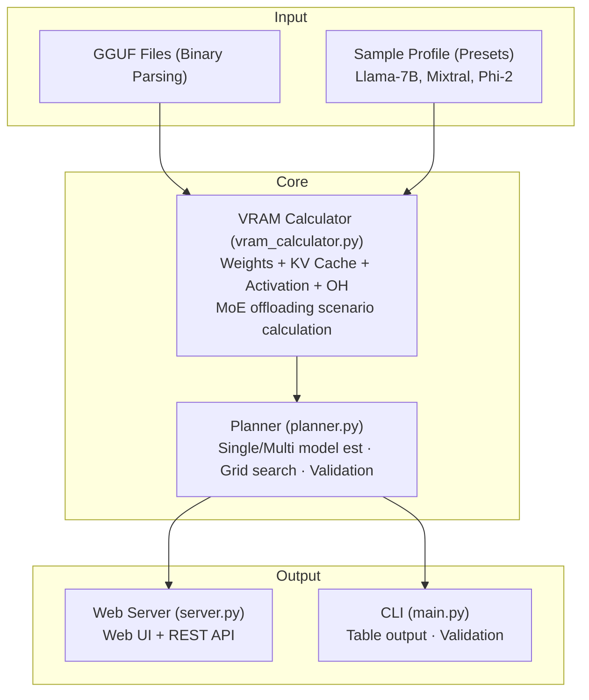

# Local Agent VRAM Resource Planner

**GGUF 메타데이터 기반 멀티 모델 VRAM 예측 및 리소스 플래닝 도구**

- 카테고리: Local LLM Infrastructure
- 스택: Python + uv, stdlib http.server, vanilla JS
- 날짜: 2026-03-13

<!--
로컬에서 LLM 에이전트를 여러 개 동시에 돌리려는 사람이 늘고 있다. 그런데 이 모델들을 같이 올리면 VRAM이 얼마나 필요한지 미리 알 수 있는 방법이 마땅히 없다. 그래서 GGUF 메타데이터만 읽어서 수식 기반으로 VRAM을 예측하는 도구를 만들었다. 실측 없이도 꽤 합리적인 추정이 가능한지가 핵심 검증 포인트였다.
-->

---

## Background

- 로컬 LLM 생태계가 빠르게 성장 중
  - llama.cpp, ollama 등으로 소비자 GPU에서 LLM 직접 실행이 보편화
  - 단일 모델을 넘어 **멀티 에이전트 워크플로**로 진화하는 추세
- 소비자 GPU의 VRAM은 제한적 (보통 8~24GB)
  - 모델 가중치 + KV 캐시 + 활성화 메모리가 겹치면 OOM
  - MoE 모델(Mixtral 등)은 expert 가중치 로딩까지 추가
- 기존 도구는 **단일 모델 기준**으로만 VRAM을 계산
  - 여러 모델을 동시에 올릴 때 총 리소스 요구량을 예측하는 도구가 없음

<!--
로컬 LLM 생태계가 꽤 빠르게 커지고 있다. 예전에는 모델 하나 돌리는 것만으로도 대단했는데, 이제는 코딩 에이전트 하나, 리뷰 에이전트 하나, 이런 식으로 여러 모델을 동시에 올리고 싶어하는 사람들이 많다. 문제는 소비자 GPU가 24GB 정도인데, 모델 두세 개 올리면 KV 캐시끼리 겹치고, MoE 모델이면 expert 가중치까지 더해져서 VRAM이 금방 터진다. 근데 이걸 미리 시뮬레이션해주는 도구가 없다.
-->

---

## Pain Point

커뮤니티에서 반복적으로 나오는 고통들:

| # | 출처 | Signal | Pain Point |
|---|------|:------:|------------|
| 1 | r/LocalLLaMA | ★★★ | MoE 모델에서 자주 쓰는 expert만 VRAM에 유지하고 나머지를 오프로드하는 동적 스케줄링이 불가능 |
| 2 | r/LocalLLaMA | ★★★ | 소비자 GPU(24GB)로 멀티 에이전트 워크플로를 실행하면 KV 캐시와 도구 호출 오버헤드로 VRAM 부족 |
| 3 | Hacker News | ★★★ | LLM 추론의 프로덕션 운영 복잡성이 과소평가되고 있으며 적절한 추론 벤치마크가 없음 |
| 4 | GitHub Trending | ★★★★★ | FP16/BF16 가중치로 인한 하드웨어 비용이 높아 엣지·CPU 환경에서 실행 불가 |

<!--
LocalLLaMA 서브레딧에서 이런 얘기가 계속 나온다. GPU 24기가로 에이전트 두 개를 동시에 돌리고 싶은데, KV 캐시가 겹치면서 VRAM이 모자라다는 거다. MoE 모델은 더 심해서, expert 8개 중에 실제로 쓰는 건 2개인데 나머지 6개도 메모리를 차지하고 있다. 결국 이건 리소스 플래닝 문제인데, 기존 도구들은 모델 하나 기준으로만 계산해준다. 여러 모델을 동시에 올릴 때 총 얼마가 필요한지는 아무도 알려주지 않는다.
-->

---

## Solution

> **"단일 모델이 아니라, 멀티 모델 워크로드 전체의 VRAM을 예측한다"**

**기존 접근**: VRAM 계산기는 모델 하나 기준. 벤치마크 도구는 개별 성능 측정만.

**우리 접근**: GGUF 메타데이터에서 모델 구조를 파싱 → 수식 기반으로 **가중치 + KV 캐시 + 활성화 + 오버헤드**를 분리 추정 → 멀티 모델 합산 → VRAM 예산 내 실행 가능 조합을 그리드 서치

- 실제 GPU 프로파일링 없이, 메타데이터만으로 합리적 추정
- llama.cpp 레퍼런스 대비 **7/7 모델 20% 이내 오차**로 검증
- MoE expert 오프로딩 시나리오까지 표시

<!--
기존 도구들이 단일 모델을 얼마나 빠르게 돌릴 수 있는가에 집중한다면, 이 프로토타입은 제한된 하드웨어에서 여러 모델을 동시에 돌리려면 어떻게 배분해야 하는가를 다룬다. 접근법은 단순하다. GGUF 파일의 메타데이터에서 모델 구조를 읽고, 가중치 메모리, KV 캐시, 활성화 메모리를 각각 수식으로 계산해서 합산한다. 실제 GPU를 안 돌려도 꽤 정확한 추정이 나온다는 게 핵심 가설이었고, llama.cpp 레퍼런스 대비 7개 모델 전부 20% 이내로 맞았다.
-->

---

## Architecture



- **gguf_parser**: Extracts model structure metadata from GGUF binaries (v2/v3 support)
- **vram_calculator**: Per-component memory formula calculation engine (4 components)
- **planner**: Multi-model aggregation, grid search, llama.cpp validation orchestration

<!--
구조는 크게 세 층이다. 맨 아래에 GGUF 파서가 바이너리 파일을 읽어서 모델 구조를 추출하고, 가운데에 VRAM 계산기가 가중치, KV 캐시, 활성화, 오버헤드를 각각 수식으로 산출한다. 그 위에 플래너가 멀티 모델 합산이나 그리드 서치를 처리한다. 외부 의존성 없이 Python 표준 라이브러리만 사용한 게 특징이다. struct 모듈로 바이너리를 파싱하고, http.server로 웹 서버를 띄운다.
-->

---

## Demo

**llama.cpp 레퍼런스 검증 — 7/7 Pass**

```
[PASS] Llama 2 7B  Q4_K_M ctx=2048: est=4,910  ref=5,500  err=10.7%
[PASS] Llama 2 7B  Q4_K_M ctx=4096: est=5,422  ref=6,000  err= 9.6%
[PASS] Llama 2 7B  Q8_0   ctx=4096: est=8,925  ref=9,200  err= 3.0%
[PASS] Llama 2 13B Q4_K_M ctx=2048: est=8,693  ref=9,000  err= 3.4%
```

**멀티 모델 시뮬레이션 — Llama-7B + Phi-2 on 24GB**

```
Total VRAM: 8,928 MB  |  Feasible: ✓  |  Headroom: 15,648 MB
```

**그리드 서치 — 8GB 예산 내 실행 가능 조합 12개 발견**

```
Phi-2 Q8_0 ctx=512:   1,620 MB  ←  가장 가벼운 조합
Llama-7B Q4_0 ctx=512: 3,753 MB
...
```

<!--
데모에서 가장 눈에 띄는 건 검증 결과다. llama.cpp 커뮤니티에서 알려진 레퍼런스 값과 비교해서 7개 모델 전부 20% 이내 오차로 통과했다. 최대 오차가 10.7%인데, 실측 없이 메타데이터만으로 이 정도면 실용적으로 쓸 만하다. 멀티 모델 시뮬레이션도 결과가 직관적이다. Llama 7B와 Phi-2를 같이 올리면 약 9기가인데, 24기가 GPU에서는 여유가 15기가 남는다. 그리드 서치로는 8기가 예산 안에서 돌릴 수 있는 조합 12개를 찾아준다.
-->

---

## Key Decisions & Lessons

### 기술 판단

| 판단 | 선택 | 이유 |
|------|------|------|
| 스택 | Python + stdlib only | GGUF 바이너리 파싱에 struct 모듈이 자연스럽고, 외부 의존성 제로 |
| UI | 웹 UI (단일 HTML) | 모델 조합 비교가 CLI 테이블보다 시각적으로 직관적 |
| 그리드 서치 | 단일 모델만 | 멀티 모델 조합은 조합 폭발 — 의도적으로 제외 |

### 시행착오

- **Phi-2 오차 31.8%** → 원인: non-gated MLP (projection 2개)를 gated (3개)로 가정
  - `ffn_projections` 파라미터 추가로 **6.8%까지 개선**
- Playwright 테스트 실패 (시스템 라이브러리 부재) → curl 기반 API 테스트로 대체

### 심의 점수

| 항목 | 점수 | 비고 |
|------|:----:|------|
| 문제 진정성 | 3.3/5 | 실제 고통이지만 niche |
| 프로토타입 적합성 | 3.7/5 | 주말 범위에 적절 |
| 신선도 | 2.7/5 | 수식 계산의 확장 |
| 학습 가치 | 3.3/5 | GGUF 파싱 + 메모리 모델링 |

<!--
핵심 기술 판단 세 가지를 공유한다. 첫째, Python 표준 라이브러리만 쓰기로 했다. struct 모듈이 바이너리 파싱에 자연스럽고, http.server로 웹까지 되니까 외부 의존성이 필요 없었다. 둘째, 흥미로운 시행착오가 있었다. Phi-2 모델의 VRAM 추정이 31%나 틀렸는데, 원인을 찾아보니 Phi-2는 non-gated MLP라서 FFN projection이 2개인데 코드에서는 3개로 가정하고 있었다. ffn_projections 파라미터를 추가해서 6.8%까지 줄였다. 결국 모델마다 아키텍처 차이를 얼마나 반영하느냐가 정확도를 결정한다. 심의에서는 조건부 승인이었는데, 반대 의견이 수식 계산의 확장이라 비자명한 도전이 부족하다는 거였다. 솔직히 맞는 말이다.
-->

---

## Results & Future

### 성과

- ✅ GGUF 메타데이터 파싱 — 8/8 통과
- ✅ 멀티 모델 VRAM 산출 — 7/7 통과
- ✅ llama.cpp 검증 20% 이내 — 7/7 (최대 오차 10.6%)
- ✅ 그리드 서치 필터링 — 74개 조합 발견
- ✅ MoE expert 오프로딩 — 7개 시나리오 표시
- **최종: SUCCESS (5/5 완료 기준 통과)**

### 한계

- "실측"이 아닌 커뮤니티 레퍼런스 값과의 비교 — 진짜 nvidia-smi 실측은 아님
- 그리드 서치가 단일 모델만 지원 (멀티 모델 조합은 조합 폭발로 제외)
- safetensors 미지원, 멀티 GPU 시나리오 미지원

### 프로덕트가 되려면

- nvidia-smi 실시간 연동으로 실측 비교 자동화
- 멀티 모델 그리드 서치 (제약 기반 최적화로 조합 폭발 해결)
- ollama / llama.cpp 런타임과 직접 통합

<!--
5개 완료 기준 전부 통과해서 SUCCESS다. 솔직히 이건 좀 아쉬운 부분도 있는데, 검증이 커뮤니티 레퍼런스 값 기반이라 진짜 nvidia-smi로 찍은 실측과 비교한 건 아니다. 그래도 수식 기반 추정이 이 정도면 실용적으로는 쓸 만하다고 본다. 이게 실제 프로덕트가 되려면, nvidia-smi 실시간 연동이 필요하고, 멀티 모델 그리드 서치에서 조합 폭발을 제약 기반 최적화로 해결해야 한다. 그리고 ollama나 llama.cpp 런타임과 직접 통합되면 예측과 실행을 한 곳에서 할 수 있을 거다.
-->
