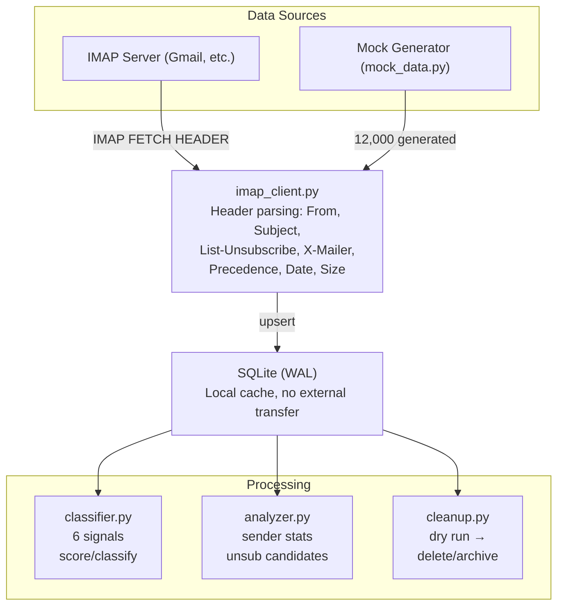

# Local Email Inbox Cleaner

**이메일 데이터가 내 머신을 절대 떠나지 않는, 완전 로컬 이메일 정리 CLI 도구**

- 카테고리: Privacy-first Productivity
- 스택: Python 3.12 · imaplib · SQLite · Rich TUI · uv
- 날짜: 2026-03-16

<!--
이메일 정리 도구라는 카테고리가 있다. Clean Email, Mailstrom 같은 서비스들. 근데 이 도구들의 공통점이 하나 있다. 내 이메일 데이터를 그쪽 서버로 보내야 한다는 거다. 이번 프로토타입은 그 문제를 정면으로 다뤘다. IMAP 헤더만으로, 데이터를 로컬에서만 처리하는 이메일 정리 도구를 만들었다.
-->

---

## Background

- 이메일 인박스는 시간이 지날수록 뉴스레터, 마케팅, 알림으로 채워진다
- 정리 도구(Clean Email, Mailstrom, Cleanfox)는 **월 $25-30 구독** + **클라우드 처리**
- 세금 신고, 의료 기록, 금융 문서가 포함된 인박스를 남의 서버로 보내야 하는 구조
- 오픈소스 대안(Inbox Zero)도 OpenAI API 키 필수 → 데이터는 여전히 외부로 전송

**핵심 모순**: 이메일을 정리하려면 프라이버시를 포기해야 한다

<!--
이메일을 정리하고 싶다는 니즈는 꽤 보편적이다. 누구나 수천 개의 안 읽은 메일이 쌓여 있다. 근데 이걸 해결하려고 도구를 쓰면, 내 이메일 전체를 그 서비스 서버로 넘겨야 한다. 세금 신고서, 병원 예약 확인, 은행 알림까지 전부. 결국 이건 프라이버시와 편의성 사이의 트레이드오프 문제인데, 지금 시장에 있는 도구들은 전부 편의성 쪽으로만 풀고 있다.
-->

---

## Pain Point

커뮤니티에서 반복적으로 나오는 신호들:

| # | 출처 | Signal | Pain Point |
|---|------|:------:|------------|
| 1 | Hacker News | ●●● | Gmail 정리 도구가 월 $25-30 구독이고 이메일 데이터 프라이버시가 불안하다 |
| 2 | r/selfhosted | ●●● | 이메일 정리 도구가 서버를 통해 처리하고, 일부는 사용자 데이터를 판매한다 |
| 3 | r/selfhosted | ●●● | 이메일 정리 도구들이 이메일을 자사 서버로 라우팅하여 프라이버시 위험 |

3개 소스 모두 **signal strength 최고치**. 프라이버시 우려가 핵심.

<!--
HN이랑 r/selfhosted에서 같은 얘기가 반복적으로 나온다. 이메일 정리하고 싶은데, 그 도구들이 내 데이터를 어떻게 쓰는지 모르겠다는 거다. signal strength가 3개 소스 전부 최고치인데, 이 정도면 꽤 명확한 신호다. 사람들이 원하는 건 이메일 정리인데, 현실적으로 선택할 수 있는 옵션이 전부 프라이버시를 포기하는 구조다.
-->

---

## Solution

> **AI 없이 IMAP 헤더 메타데이터만으로 분류하고, 데이터는 로컬을 떠나지 않는다**

기존 솔루션과의 차이:

| | Clean Email | Inbox Zero | **이 도구** |
|---|---|---|---|
| 데이터 위치 | 클라우드 서버 | OpenAI 서버 | **로컬 머신** |
| 분류 방식 | 클라우드 ML | GPT API | **헤더 휴리스틱** |
| 비용 | 월 $10+ | API 비용 | **무료** |
| 이메일 본문 접근 | 필요 | 필요 | **불필요** |

검증 목표: 헤더만으로도 80%+ 분류 정확도를 달성할 수 있는가?

<!--
접근법은 단순하다. 이메일 본문을 아예 안 가져온다. 헤더 메타데이터만으로 분류한다. List-Unsubscribe 헤더가 있으면 뉴스레터일 확률이 높고, X-Mailer가 Mailchimp면 마케팅이다. 이런 시그널 6개를 조합해서 스코어링하는 방식이다. AI가 필요 없으니 데이터가 외부로 나갈 이유가 없다. 검증하고 싶었던 건 이 단순한 접근으로 80% 이상 정확도가 나오는지였다.
-->

---

## Architecture



<!--
구조는 직관적이다. IMAP 서버에서 헤더만 가져와서 SQLite에 캐싱하고, 그 위에 classifier, analyzer, cleanup 세 모듈이 올라간다. 핵심은 데이터 흐름이 한 방향이라는 거다. 서버에서 로컬로만 흐르고, 삭제 명령만 역방향으로 간다. Mock Generator가 있어서 실제 IMAP 서버 없이도 12,000개 이메일로 전체 플로우를 검증할 수 있다.
-->

---

## Demo

```
╔══════════════════════════════════╗
║         Inbox Cleaner           ║
║      12,000 emails analyzed     ║
╚══════════════════════════════════╝

╭────────────────┬───────┬────────┬────────────────╮
│ Category       │ Count │ Unread │ Total Size     │
├────────────────┼───────┼────────┼────────────────┤
│ newsletter     │ 3,240 │ 2,430  │ 48.6 MB        │
│ marketing      │ 2,880 │ 2,304  │ 57.6 MB        │
│ notification   │ 2,160 │ 1,080  │ 21.6 MB        │
│ old            │ 1,920 │   960  │ 28.8 MB        │
│ personal       │ 1,800 │   540  │ 18.0 MB        │
╰────────────────┴───────┴────────┴────────────────╯

Total cleanup: 10,200 emails | 156.6 MB recoverable
```

12,000개 이메일 → 로드 0.3초, 분류 0.3초, **156MB 정리 가능**

<!--
실행하면 이런 화면이 나온다. 12,000개 이메일을 분류하는 데 0.3초 걸린다. 카테고리별로 몇 개인지, 안 읽은 게 몇 개인지, 용량이 얼마인지 한눈에 보인다. 여기서 personal을 제외한 나머지가 정리 대상인데, 156MB 정도 확보할 수 있다고 알려준다. dry run이라 실제로 지워지는 건 아니고, 지우겠다고 확인하면 그때 실행한다.
-->

---

## Key Decisions & Lessons

**1. AI 대신 헤더 휴리스틱을 선택한 이유**
- 6개 시그널(List-Unsubscribe, Precedence, X-Mailer, Domain, Subject, Age)의 가중치 합산
- 결과: **88% 정확도** (목표 80% 초과 달성)
- "this week" → "this week in|this week's"로 패턴 수정하여 85.3% → 88.0% 개선

**2. Mock 데이터 12,000개를 먼저 만든 판단**
- 실제 IMAP 서버 없이 전체 파이프라인 검증 가능
- 분류 정확도를 정량적으로 측정할 수 있는 ground truth 확보

**3. 심의 점수와 반대 의견**

| 항목 | 점수 |
|---|---|
| 문제 진정성 | 3.7/5 |
| 프로토타입 적합성 | 4.3/5 |
| 신선도 | 2.7/5 |
| 학습 가치 | 2.7/5 |

> *"기술적으로 비자명한 도전이 없음 — if-else 규칙 기반 분류 + imaplib 래핑 수준"* — 준혁

<!--
기술적으로 가장 중요한 판단은 AI를 안 쓴 거다. 이메일 헤더에는 이미 충분한 시그널이 있다. List-Unsubscribe 헤더가 있으면 그건 뉴스레터다. X-Mailer가 Mailchimp면 마케팅이다. 이런 시그널 6개를 조합하니까 88%가 나왔다. 솔직히 준혁 의견이 맞는 부분도 있다. 기술적으로 어려운 건 아니다. 근데 프로토타입의 목적은 기술적 도전이 아니라 검증이다. 헤더만으로 충분한가, 이걸 확인하는 게 목표였다.
-->

---

## Results & Future

### 성과
- [x] 12,000개 헤더 fetch **0.26초** (기준: 5분)
- [x] Rich TUI 발신자 통계 테이블 출력
- [x] 분류 정확도 **88.0%** (기준: 80%)
- [x] 드라이런 미리보기 — 9,912개, 710MB 절감 표시
- [x] 실제 삭제 실행 — 6,600개 정리 (12,000 → 5,400)

### 한계
- OAuth 미지원 (앱 비밀번호만 가능)
- 이메일 본문 미분석 → 맥락 기반 분류 불가
- 신선도 2.7/5 — 기존에도 비슷한 시도가 있었다

### 프로덕트가 되려면
- OAuth 2.0 인증 플로우 (Gmail, Outlook)
- 사용자 피드백 기반 분류 규칙 학습 (로컬 ML)
- 크로스 플랫폼 GUI (Tauri 등)
- 자동 구독 해지 실행 기능

<!--
5개 완료 기준을 전부 통과했다. 특히 fetch 속도가 기준 대비 1,000배 이상 빨랐는데, 이건 mock 데이터라 당연한 부분이 있다. 실제 IMAP 서버에서는 네트워크 지연이 있을 거다. 한계도 명확하다. OAuth가 없으면 Gmail에서 쓰기 어렵고, 본문을 안 보니까 맥락 기반 분류는 못 한다. 프로덕트로 가려면 OAuth 인증이 최우선이고, 사용자 피드백으로 분류 규칙을 개선하는 로컬 ML 레이어가 필요하다.
-->
