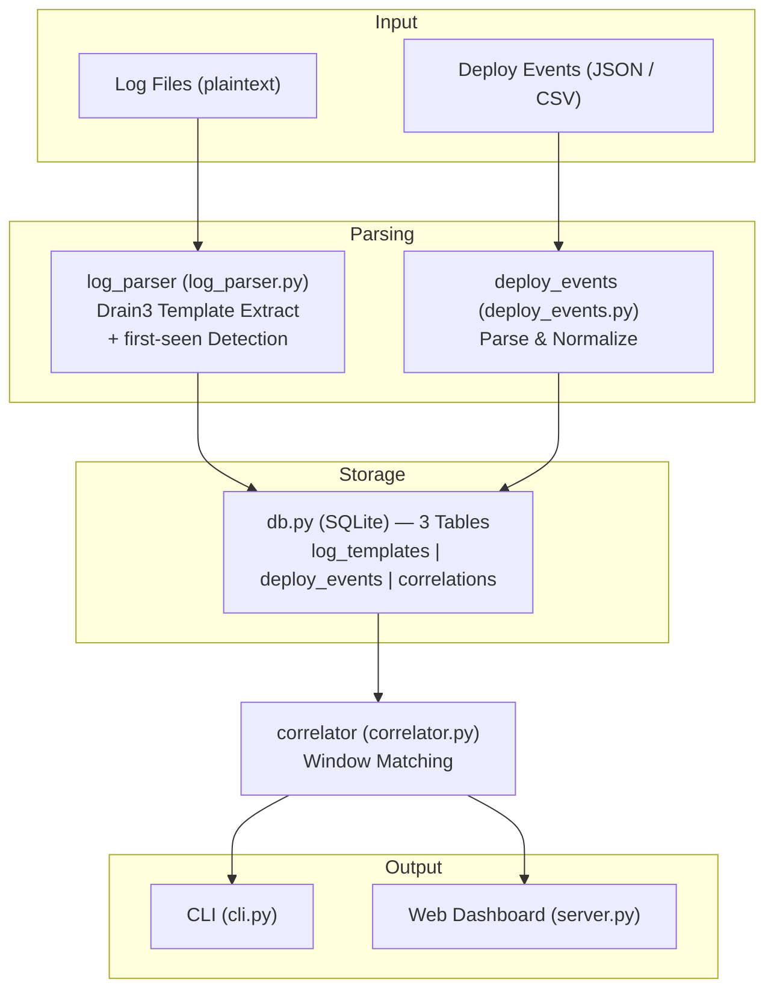

# Log-Incident Correlator

**배포하면 새 에러가 터진다. 그걸 자동으로 찾아주는 도구.**

- 카테고리: Observability / Incident Analysis
- 스택: Python, Drain3, SQLite, vanilla JS
- 날짜: 2026-03-12

<!--
로그 인시던트 코릴레이터라는 프로토타입을 만들었다. 한 줄로 요약하면, 배포 이후에 처음 등장한 에러 패턴을 자동으로 찾아서 연결해주는 도구다. Drain3라는 로그 클러스터링 알고리즘과 SQLite를 조합했고, Python으로 구현했다.
-->

---

## Background

- 프로덕션 환경에서 시간당 **10만 건 이상**의 로그가 쏟아진다
- 이 중 진짜 새로운 에러를 찾으려면, 기존에 보던 패턴을 다 걸러내야 한다
- 새벽 3시 인시던트가 터지면: CloudWatch 로그 열고, GitHub 배포 이력 확인하고, Slack 알림 뒤지고 — 이걸 사람이 수동으로 교차 분석한다
- 기존 도구들은 **ML 학습이 필요**하거나(LogAI, Loglizer), **대규모 인프라가 전제**된다(OpenSearch)

<!--
프로덕션 로그를 다뤄본 사람은 안다. 시간당 10만 건이 쏟아지는데, 대부분은 이미 알고 있는 패턴이다. 문제는 그 속에서 처음 보는 에러를 찾는 거다. 그리고 그 에러가 어떤 배포 때문에 생긴 건지를 알아내려면, 로그 플랫폼 열고, 배포 이력 열고, 타임라인을 눈으로 맞춰봐야 한다. 새벽 3시에 이걸 하고 있으면 꽤 고통스럽다.
-->

---

## Pain Point

커뮤니티에서 반복적으로 나오는 신호들:

| # | 출처 | Signal | Pain Point |
|---|------|:------:|------------|
| 1 | HN | ★★★ | 10만 건/시간 로그에서 **처음 보는 희귀 패턴**을 수천 개의 경고 속에서 찾기 어렵다 |
| 2 | HN | ★★★ | 로그 스토리지와 분석 시스템이 분리되어 **비용과 복잡도**가 높다 |
| 3 | Reddit | ★★★ | 새벽 인시던트 시 CloudWatch + GitHub + 알림을 **수동 교차 분석**해야 한다 |

> 결국 이건 세 가지가 따로 노는 문제다: 로그 분석, 배포 추적, 그리고 둘의 연결.

<!--
HN이나 Reddit에서 이 주제가 계속 나온다. 크게 세 가지다. 첫째, 로그가 너무 많아서 새로운 에러를 못 찾겠다. 둘째, 로그 플랫폼 자체가 무겁고 비싸다. 셋째, 인시던트 때 여러 시스템을 수동으로 오가면서 교차 분석해야 한다는 거다. 결국 로그 분석과 배포 추적이 따로 놀고 있고, 이 둘을 연결하는 가벼운 도구가 없다는 문제다.
-->

---

## Solution

**ML 학습 없이, 배포 이후 처음 등장한 로그 패턴을 자동으로 찾아 연결한다.**

핵심 아이디어:

1. **Drain3 알고리즘**으로 로그를 온라인 클러스터링 → 템플릿 추출
2. 새 클러스터가 생성되는 순간 = **"first-seen"** 패턴
3. 배포 이벤트 이후 시간 윈도우(30분) 내 first-seen → **자동 상관관계**

기존 도구와의 차이:

| | LogAI/Loglizer | OpenSearch | **이 도구** |
|---|---|---|---|
| ML 학습 | 필요 | 필요 | **불필요** |
| 인프라 | Python 라이브러리 | 클러스터 운영 | **SQLite 하나** |
| 배포 연동 | 없음 | 없음 | **자동 상관관계** |

<!--
접근법은 단순하다. Drain3라는 로그 클러스터링 알고리즘이 있다. 로그 한 줄을 넣으면 기존 템플릿에 매칭하거나, 매칭이 안 되면 새 클러스터를 만든다. 이 "새 클러스터 생성" 이벤트가 곧 first-seen 패턴이다. 여기에 배포 타임라인을 오버레이하면, 어떤 배포 이후에 어떤 새 에러가 등장했는지를 자동으로 연결할 수 있다. ML 학습이 필요 없고, SQLite 하나로 돌아간다. 기존 도구들이 못 하는 조합이다.
-->

---

## Architecture



<!--
구조는 심플하다. 왼쪽에서 로그 파일이 들어오고 오른쪽에서 배포 이벤트가 들어온다. 각각 파서를 거쳐서 SQLite에 저장되고, correlator가 시간 윈도우 기반으로 둘을 매칭한다. 출력은 CLI와 웹 대시보드 두 가지다. 전체 파일이 8개 정도고, 외부 의존성은 Drain3 하나뿐이다. 나머지는 다 표준 라이브러리다.
-->

---

## Demo

```
$ uv run python cli.py demo

  DEPLOY: 2026-03-12T03:00:00
  COMMIT: a1b2c3d — Payment module refactor v2.1
  NEW TEMPLATES AFTER DEPLOY: 3
  ⏱ +1.4min │ ERROR [payment] NullPointerException in PaymentProcessor.charge()
  ⏱ +2.2min │ ERROR [payment] Failed to process payment: missing field 'currency'
  ⏱ +3.6min │ WARN  [payment] Retry attempt <*>/3 for transaction <*>

  DEPLOY: 2026-03-12T10:00:00
  COMMIT: e4f5g6h — Auth service certificate rotation
  NEW TEMPLATES AFTER DEPLOY: 2
  ⏱ +1.7min │ ERROR [auth] LDAP connection timeout after 30s
  ⏱ +4.1min │ ERROR [auth] Failed to validate token: certificate expired
```

**12,000줄 로그 → 21개 템플릿 추출 → 3개 배포에 8개 신규 패턴 자동 연결**

<!--
데모를 돌리면 이런 결과가 나온다. 12,000줄짜리 샘플 로그를 Drain3로 파싱하면 21개 템플릿이 나온다. 그 중에서 배포 이후 30분 내에 처음 등장한 패턴 8개를 자동으로 잡아낸다. Payment 모듈 리팩터링 배포 이후에 NullPointerException이 처음 등장했다, 인증서 로테이션 이후에 certificate expired가 처음 나왔다. 이런 걸 사람이 수동으로 찾을 필요 없이 자동으로 연결해준다.
-->

---

## Key Decisions & Lessons

### 기술 판단

| 판단 | 선택 | 이유 |
|------|------|------|
| 언어 | Python (Go/Rust 대신) | Drain3 라이브러리가 Python에만 존재. 프로토타입 범위에서 포팅은 과도 |
| 웹 서버 | `http.server` (표준 라이브러리) | 외부 의존성 최소화. Flask/FastAPI 없이도 JSON API + 정적 파일 서빙 가능 |
| 시각화 | Canvas 직접 렌더링 | Chart.js 같은 라이브러리 없이 타임라인 구현. 의존성 0 |

### 심의 점수

- 프로토타입 적합성: **4.0/5** — 범위가 명확하고 4시간 내 검증 가능
- 학습 가치: **4.0/5** — Drain3 알고리즘 + 시간 윈도우 상관관계 패턴
- 문제 진정성: **3.7/5** — 커뮤니티 신호는 강하지만, 소규모 팀 타겟이 니치

<!--
기술 판단에서 가장 중요했던 건 스택 선택이다. 원래 아이디어에는 Go나 Rust 단일 바이너리가 있었는데, Drain3가 Python에만 있다. 프로토타입에서 알고리즘을 포팅하는 건 범위를 넘어서니까, Python으로 갔다. 웹 서버도 마찬가지다. Flask를 쓸 수도 있었는데, http.server 표준 라이브러리로 충분했다. 프로토타입에서 의존성을 늘리는 건 검증과 무관한 복잡도를 추가하는 거다.
-->

---

## Results & Future

### 성과 (5/5 완료 기준 통과)

- ✅ 1만 줄 이상 로그 → Drain3 템플릿 추출 + first-seen 탐지
- ✅ 배포 이벤트 → 시간 윈도우 내 신규 템플릿 자동 연결
- ✅ SQLite 저장 → 재분석 가능
- ✅ HTML 대시보드 타임라인 시각화
- ✅ "배포 X 이후 에러 Y 등장" 시나리오 데모

### 한계점

- 파일 기반 배치 분석만 가능 (실시간 스트리밍 미지원)
- Drain3의 `sim_th` 튜닝에 따라 템플릿 품질이 달라짐
- 대시보드 시각적 검증 부족 (Playwright 시스템 제약)

### 프로덕트가 되려면

- 실시간 로그 테일링 (tail -f 스타일 스트리밍)
- GitHub/GitLab webhook으로 배포 이벤트 자동 수집
- Slack/PagerDuty 연동: "이 배포 이후 새 에러 3건 감지" 알림
- Drain3 파라미터 자동 튜닝 또는 사용자 피드백 루프

<!--
완료 기준 5개를 다 통과했다. 솔직히 아쉬운 부분은 있다. 파일 기반 배치 분석이라 실시간 모니터링은 안 된다. Drain3의 similarity threshold 값에 따라 템플릿 품질이 꽤 달라지는데, 이걸 자동으로 튜닝하는 건 프로토타입 범위를 넘어선다. 프로덕트가 되려면 실시간 스트리밍, webhook 연동, 알림 시스템이 필요하다. 그래도 핵심 가설인 "ML 학습 없이 first-seen 패턴을 배포와 연결할 수 있는가"는 검증됐다. 12,000줄 로그에서 8건의 상관관계를 자동으로 찾아냈다.
-->
