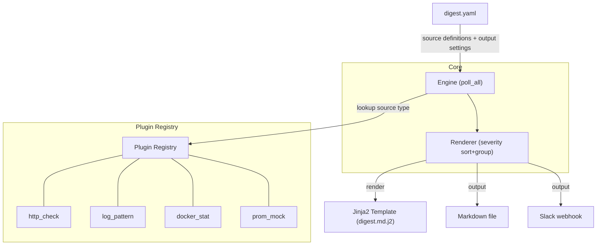

# Proactive Alert Digest

> YAML 설정만으로 멀티소스 모니터링 → "오늘 아침에 뭘 봐야 하는지" 한 장짜리 다이제스트

**카테고리**: DevOps / Observability
**스택**: Python, Click, PyYAML, Jinja2, Requests
**날짜**: 2026-03-17

<!--
모니터링 도구는 많은데, 매일 아침 "그래서 뭘 봐야 하는데?"라는 질문에 답해주는 도구는 없다.
오늘 소개할 프로토타입은 그 질문에 대한 답이다.
YAML 파일 하나로 여러 모니터링 소스를 긁어서 한 장짜리 요약을 만들어주는 CLI 도구다.
-->

---

## Background

- 개발자와 SRE는 매일 아침 **Datadog, Grafana, CloudWatch**를 수동으로 순회한다
- ML 학습이 밤새 크래시해도 아침까지 모르고 지나치는 일이 반복된다
- 기존 알림 시스템은 **개별 이벤트를 실시간으로 쏘는 구조** — 하루 전체를 조감하는 다이제스트가 없다
- 홈랩/소규모 환경에서 Wazuh 같은 SIEM은 너무 무겁고, Prometheus+Alertmanager는 설정이 복잡하다

**결국 이건 "아침 브리핑" 문제다.**
의사가 아침에 환자 차트를 돌 때, 모든 바이탈을 하나하나 여는 게 아니라 요약된 라운딩 시트를 본다. 서버도 마찬가지다.

<!--
개발자들이 아침에 하는 일이 있다. Datadog 열고, Grafana 열고, CloudWatch 열고.
문제는 이게 매일 반복되는 의식인데, 아무 이상이 없어도 하고 있어야 한다는 거다.
그리고 정작 밤새 뭔가 터졌을 때, 이 순회를 하기 전까지는 모른다.
결국 이건 정보 조감의 문제다. 개별 알림은 넘치는데, "오늘 전체적으로 어떤데?"를 알려주는 도구가 없다.
-->

---

## Pain Point — 커뮤니티 시그널

| # | 출처 | Signal | Pain Point |
|---|------|:------:|------------|
| 1 | Hacker News | ⬛⬛⬛ | 매일 아침 Datadog를 수동으로 확인하는 것이 번거로움 |
| 2 | Hacker News | ⬛⬛⬛ | ML 학습 크래시를 아침까지 모름 — 기존 도구의 실시간 모니터링 부재 |
| 3 | r/selfhosted | ⬛⬛ | SIEM+SOAR가 홈 환경에서 너무 무거워 가벼운 모니터링 자동화 불가 |

**공통 패턴**: 도구는 많은데, "오늘 아침에 뭘 봐야 하는지" 알려주는 건 없다.

<!--
HN이랑 Reddit에서 계속 나오는 얘기가 있다.
모니터링 도구가 좋은데, 알림이 너무 많아서 피로하다는 거다. 실시간으로 쏟아지는 알림은 있는데, 하루를 한 장으로 요약해주는 기능은 없다.
특히 홈랩이나 소규모 팀에서는 Wazuh 같은 무거운 솔루션을 돌릴 여유가 없다.
그래서 결국 수동 순회로 돌아간다. 이 패턴이 반복되고 있다.
-->

---

## Solution

### 한 줄 요약
**"설정 5분, YAML 하나로 오늘 아침 브리핑을 자동 생성"**

### 기존 솔루션과의 차이

| 기존 | Proactive Alert Digest |
|------|----------------------|
| Keep, OneUptime — 자체 인프라 배포 필요 | YAML 파일 하나 + cron |
| Alertmanager — 개별 실시간 알림 | 하루 전체 조감 다이제스트 |
| Uptime Kuma — 업타임만 모니터링 | HTTP + 로그 + Docker + 메트릭 통합 |

### 검증 목표
> YAML 설정만으로 멀티소스를 폴링하여 실무적으로 유용한 일일 다이제스트를 생성할 수 있는가?

<!--
접근법은 단순하다. YAML 파일 하나에 어떤 소스를 볼 건지 정의하고, cron으로 돌리면 끝.
기존 도구들과 뭐가 다르냐면, 이건 풀스택 모니터링 플랫폼이 아니다.
"오늘 아침에 뭘 봐야 하는지"라는 하나의 질문에만 집중한다.
Keep이나 OneUptime은 좋은 도구인데, 소규모 환경에서 배포하려면 그게 또 하나의 인프라다.
여기선 YAML 하나면 된다.
-->

---

## Architecture



- **Engine**: Reads YAML → creates plugin instances → polls all sources
- **Plugin**: `Protocol`-based, extensible by implementing `poll() → list[Alert]` interface
- **Renderer**: Sorts by severity → renders Markdown via Jinja2

<!--
구조는 꽤 직관적이다. YAML에서 설정을 읽고, 플러그인 레지스트리에서 해당 소스 타입을 찾아서 폴링한다.
핵심은 플러그인 구조다. Protocol 기반이라 ABC 상속 없이 poll 메서드만 있으면 된다.
Python의 duck typing을 그대로 살린 거다.
결과는 심각도순으로 정렬돼서 Jinja2 템플릿을 통해 마크다운으로 나온다. Slack webhook 전송도 된다.
-->

---

## Demo

```bash
$ uv run python cli.py init
✅ Sample config written to digest.yaml

$ uv run python cli.py run
📋 Loading config from digest.yaml...
🔍 Polling 5 source(s)...
📝 Generating digest (7 alert(s))...
💾 Digest saved to digest_output.md
Done! ✨
```

### 생성된 다이제스트

```
🔔 Alert Digest — 2026-03-17 03:25

  7 alerts: 2 critical · 2 warning · 0 info · 3 ok

⚡ 오늘 확인할 것
- 🔴 Example API: Connection failed — Cannot reach https://httpstat.us/500
- 🔴 Prometheus Metrics: CPU usage > 90% — Host server-01 CPU at 94%
- 🟡 App Logs: 4 match(es) for 'ERROR|error|Error' — Last match: ...
- 🟡 Prometheus Metrics: Memory usage > 80% — Host server-02 memory at 83%
```

<!--
두 명령이면 끝이다. init으로 샘플 YAML을 만들고, run으로 다이제스트를 생성한다.
출력을 보면 critical이 위에, ok가 아래에 온다. "오늘 확인할 것" 섹션에 critical과 warning만 모아서 보여준다.
아침에 이것만 보면 된다. 전부 초록색이면 커피 마시면 되고, 빨간색이 있으면 그것부터 보면 된다.
-->

---

## Key Decisions & Lessons

### 기술 판단

| 판단 | 선택 | 이유 |
|------|------|------|
| 플러그인 구조 | `Protocol` (not ABC) | 상속 불필요, duck typing으로 확장 용이 |
| Docker 연동 | `subprocess` (not Docker SDK) | 의존성 최소화, 프로토타입 수준에서 충분 |
| 프로젝트 구조 | flat (no `src/`) | 프로토타입이므로 단순하게 |

### 심의 점수

| 항목 | 점수 |
|------|------|
| 문제 진정성 (Authenticity) | 3.7 / 5 |
| 프로토타입 적합성 (Prototypability) | **4.3 / 5** |
| 신선도 (Freshness) | 3.0 / 5 |
| 학습 가치 (Learning Value) | 2.7 / 5 |

**반대 의견**: "기술적 도전이 부족하다 — HTTP 폴링 + 템플릿 렌더링 조합으로, 새로운 학습이 제한적" (준혁)

<!--
솔직히 이 프로토타입은 기술적으로 어렵지 않다. HTTP 폴링하고 템플릿 렌더링하는 거니까.
심의에서도 학습 가치가 2.7로 낮게 나왔다. 준혁이 반대한 이유도 그거다.
그런데 프로토타입 적합성이 4.3으로 높다. 빠르게 만들어서 바로 써볼 수 있다는 뜻이다.
기술 판단에서는 Protocol 기반 플러그인 구조가 핵심이었다. ABC 상속 대신 duck typing으로 가니까 새 플러그인 추가가 정말 간단하다.
-->

---

## Results & Future

### 성과 — 5/5 SUCCESS ✓

- [x] `digest init`으로 샘플 YAML 생성 (3개 소스 타입)
- [x] HTTP 헬스체크 + 로그 패턴 + Docker 상태 플러그인 동작
- [x] 심각도별 정렬된 마크다운 다이제스트 생성
- [x] Slack webhook 전송 성공
- [x] 새 플러그인(prometheus_mock) 추가로 확장성 데모

### 한계점
- Prometheus는 mock 데이터로 대체 — 실제 API 연동 미검증
- 이상 탐지나 트렌드 분석 없음 — 단순 폴링 + 요약
- 알림 상관관계 분석 미지원

### 프로덕트가 되려면
- **실제 Prometheus/Grafana API 연동** 및 인증 처리
- **이력 저장** (SQLite) → 어제 대비 변화 감지
- **스케줄러 내장** (cron 의존 탈피)
- **알림 상관관계**: 같은 사건의 다른 증상을 묶어주는 로직

<!--
완료 기준 5개 전부 통과했다. 에러 없이 첫 시도에 전체 파이프라인이 돌았다.
솔직히 좀 아쉬운 건 Prometheus가 mock이라는 거다. 실제 API 연동은 안 해봤다.
그리고 지금은 단순 폴링이라 "어제보다 나빠졌다"를 모른다. 이력 저장이 되면 그게 가능해진다.
프로덕트로 가려면 결국 상관관계 분석이 필요하다. CPU가 치솟고 메모리도 치솟으면 그건 별개가 아니라 같은 사건의 증상일 수 있다. 그걸 묶어주는 게 다음 단계다.
-->
