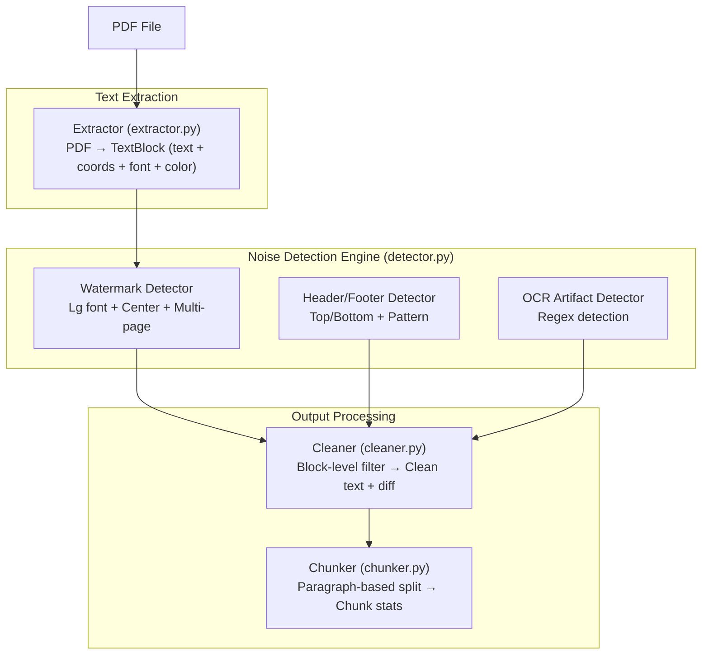

# RAG Document Quality Diagnosis & Preprocessing Tool

**PDF 문서의 OCR 노이즈를 자동 감지·제거하여 RAG 파이프라인의 입력 품질을 보장하는 CLI 도구**

- **카테고리**: Developer Tools / RAG Pipeline
- **스택**: Python, PyMuPDF, uv, argparse
- **날짜**: 2026-03-01

<!--
RAG 파이프라인을 운영하다 보면, 결국 성능의 천장은 모델이 아니라 입력 데이터 품질이 결정한다는 걸 알게 된다. 오늘 이야기할 건 그 입력 품질, 그중에서도 PDF 문서에서 발생하는 노이즈를 어떻게 자동으로 걸러낼 수 있는지에 대한 프로토타입이다.
-->

---

## Background

- RAG(Retrieval-Augmented Generation)이 사실상 LLM 애플리케이션의 표준 패턴이 됨
- 그런데 "Garbage In, Garbage Out"이 RAG에서 특히 심각함
  - PDF → OCR → 텍스트 추출 과정에서 **워터마크, 반복 헤더/푸터, 깨진 문자**가 그대로 임베딩됨
  - 이 노이즈가 벡터 검색 결과를 오염시키고, 불필요한 토큰을 소비함
- 기존 도구들(Unstructured.io, LangChain, LlamaIndex)은 **"문서를 처리하는 것"**에 집중
  - 처리 결과의 품질을 **진단하는** 도구는 사실상 없음

<!--
RAG 파이프라인이 보편화되면서, 모두가 retrieval 정확도나 프롬프트 엔지니어링에 집중한다. 그런데 한 발 뒤로 물러서 보면, 검색 결과가 엉망인 이유가 모델이 아니라 입력 문서의 품질인 경우가 꽤 많다. PDF에서 텍스트를 뽑으면 워터마크가 "DRAFT DRAFT DRAFT"로 들어오고, 모든 페이지마다 "Confidential · Do Not Distribute · Page 1"이 반복된다. 이게 다 청크에 들어가서 검색을 오염시킨다. 결국 이건 파이프라인의 가장 앞단에서 발생하는 품질 문제인데, 아무도 여기에 집중하지 않고 있다.
-->

---

## Pain Point

커뮤니티에서 반복적으로 나오는 고통 3가지:

| # | 출처 | Signal | Pain Point |
|---|------|:------:|------------|
| 1 | HackerNews | ★★★ | LangChain 청커가 대용량 문서에서 느리고 메모리 과다 사용 |
| 2 | r/LocalLLaMA | ★★★ | **PDF 워터마크가 OCR 텍스트로 인식**되어 RAG 검색 정확도 저하 |
| 3 | r/LocalLLaMA | ★★★ | 시스템 프롬프트·RAG 컨텍스트 비대화로 **LLM API 비용·레이턴시 급증** |

공통 패턴: "원본 문서 → 청크 → 벡터 → 프롬프트" 파이프라인의
**서로 다른 단계에서 발생하는 품질 병목**

<!--
세 가지 pain point가 출처는 다르지만 결국 같은 이야기를 하고 있다. 워터마크가 텍스트로 인식되고, 반복 헤더가 청크를 오염시키고, 그 결과로 불필요한 토큰이 프롬프트에 들어간다. 사람으로 치면, 의사가 환자 차트를 읽는데 모든 페이지에 병원 로고와 면책 조항이 반복되는 걸 매번 읽어야 하는 상황이다. 사람은 알아서 건너뛰지만, RAG 파이프라인은 그러지 못한다.
-->

---

## Solution

**한 줄 요약**: RAG 파이프라인의 "린터(linter)" — 문서 투입 전에 노이즈를 진단하고 제거

### 기존 도구와의 차이

| 기존 (Unstructured, LangChain) | 이 도구 |
|---|---|
| 문서를 **처리**하는 것 | 처리 결과의 **품질을 진단**하는 것 |
| 워터마크 특화 감지 없음 | 폰트크기 + 좌표 + 반복패턴으로 감지 |
| 노이즈 포함 여부 모름 | JSON 리포트로 정확히 어떤 노이즈인지 보여줌 |

### 핵심 접근

- 외부 API/ML 모델 없이, **PyMuPDF 좌표 + 휴리스틱 규칙**만으로 감지
- `diagnose` → `clean` → `stats` 3단계 파이프라인

<!--
기존 도구들이 문서를 처리하는 데 집중한다면, 이 도구는 처리 결과의 품질을 진단하는 메타 레벨의 접근이다. 코드에 비유하면 린터와 마찬가지다. 코드를 컴파일하기 전에 린터로 문제를 잡듯이, RAG에 문서를 투입하기 전에 노이즈를 잡는다. 그리고 의도적으로 ML 모델이나 외부 API를 쓰지 않았다. PDF에서 추출한 텍스트 블록의 좌표, 폰트 크기, 색상 정보만으로 충분히 판별 가능하다.
-->

---

## Architecture



<!--
아키텍처는 의도적으로 단순하게 만들었다. extractor가 PDF에서 좌표 포함 텍스트 블록을 뽑고, detector가 세 가지 규칙으로 노이즈를 감지하고, cleaner가 블록 단위로 필터링한다. 각 단계가 독립적이라 테스트도 쉽고 디버깅도 쉽다. 전체가 300줄 안팎인데, 이 정도면 프로토타입으로 충분하다.
-->

---

## Demo

### diagnose — 노이즈 감지 결과
```json
{
  "summary": {
    "total_pages": 4, "total_blocks": 24,
    "watermarks_found": 1, "headers_footers_found": 2
  },
  "watermarks": [
    { "text": "DRAFT", "pages": [1,2,3,4], "avg_font_size": 72.0 }
  ]
}
```

### clean — 정제 결과
```
Page 1:
  - [watermark] DRAFT
  - [header_footer] Acme Corp · Annual Report 2025
  - [header_footer] Confidential · Do Not Distribute · Page 1
  → 15.7% reduction (504 → 425 chars)

Total items removed: 12
```

<!--
실제 실행 결과를 보면, diagnose 명령이 워터마크 "DRAFT"가 4개 페이지에 72pt 폰트로 반복된다는 걸 JSON으로 깔끔하게 보여준다. clean 명령은 페이지별로 어떤 노이즈가 제거됐는지 diff 리포트를 보여주고, 정제된 텍스트를 출력한다. 이 예시에서 페이지당 약 15% 정도의 불필요한 텍스트가 제거됐다. 이 15%가 RAG 파이프라인에서는 꽤 의미 있는 차이다.
-->

---

## Key Decisions & Lessons

### 기술 판단

| 판단 | 이유 |
|------|------|
| PyMuPDF 선택 | 텍스트 블록을 **좌표 + 폰트크기 + 색상**과 함께 추출 가능 — 위치 기반 감지에 필수 |
| ML 모델 없이 휴리스틱만 | 외부 의존성 제로, 프로토타입 범위에 적합. 워터마크는 "큰 폰트 + 중앙 + 반복"으로 충분히 잡힘 |
| 테스트 PDF 직접 생성 | 실제 노이즈가 정확히 뭔지 통제 가능. 감지 로직 검증이 확실해짐 |

### 시행착오
- 페이지 번호 정규화에서 "X-200" 같은 모델명의 숫자까지 `{n}`으로 치환되는 false positive 발생 → 정규식을 개선하여 알파벳/하이픈에 인접한 숫자는 보존
- `■□■□` 문자가 PyMuPDF에서 `??????`으로 변환됨 → `RE_REPEATED_QMARK` 패턴 추가

### 심의 점수: 문제 진정성 3.7 · 프로토타입 적합성 4.0 · 신선도 3.3

<!--
몇 가지 흥미로운 판단이 있었다. 첫째, ML 모델 없이 휴리스틱만으로 했는데, 워터마크라는 게 결국 큰 폰트, 페이지 중앙, 여러 페이지 반복이라는 매우 명확한 시각적 패턴을 가지고 있어서 규칙 기반으로 충분했다. 둘째, 페이지 번호 정규화가 생각보다 까다로웠다. "Page 1"의 1은 페이지 번호인데, "X-200"의 200은 모델명이다. 이걸 구분하려면 숫자 주변의 컨텍스트를 봐야 한다. 작은 문제 같지만, 이런 디테일이 감지 정확도를 결정한다.
-->

---

## Results & Future

### 성과 (5/5 완료 기준 통과)
- ✅ `diagnose`: 워터마크·헤더/푸터·OCR 아티팩트 감지 → JSON 리포트
- ✅ `clean`: 노이즈 제거 + per-page diff 리포트 + 정제 텍스트 출력
- ✅ 3개 샘플 PDF에서 전수 감지 (워터마크, 헤더/푸터, OCR 아티팩트 6건)
- ✅ 청킹 통계 (크기 분포, 중복률)
- ✅ README 사용법 및 예시 출력 포함

### 한계점
- 이미지 레벨 워터마크는 미지원 (이미지 프로세싱 영역)
- 의미적 청킹 품질 분석 없음 (임베딩 모델 필요)
- 실제 운영 규모의 PDF 컬렉션에서 성능 미검증

### 프로덕트가 되려면
- 배치 처리 (디렉토리 단위 스캔) + CI 파이프라인 연동
- 사용자 정의 노이즈 규칙 추가 (특정 도메인의 반복 패턴)
- 의미적 청킹 품질 진단 (임베딩 기반 일관성 분석)

<!--
솔직히 이건 좀 아쉬운 부분이 있다. 이미지로 된 워터마크는 아예 건드리지 못한다. 그리고 세 개의 샘플 PDF에서만 테스트했기 때문에, 실제 운영 환경의 다양한 PDF에서 어떻게 동작할지는 미지수다. 그래도 프로토타입의 목적은 달성했다고 본다. RAG 파이프라인에 문서를 투입하기 전에, 린터처럼 노이즈를 먼저 걸러내는 게 의미 있다는 걸 확인했다. 프로덕트로 가려면 배치 처리, 커스텀 규칙, 그리고 의미적 청킹 분석까지 붙여야 한다.
-->
