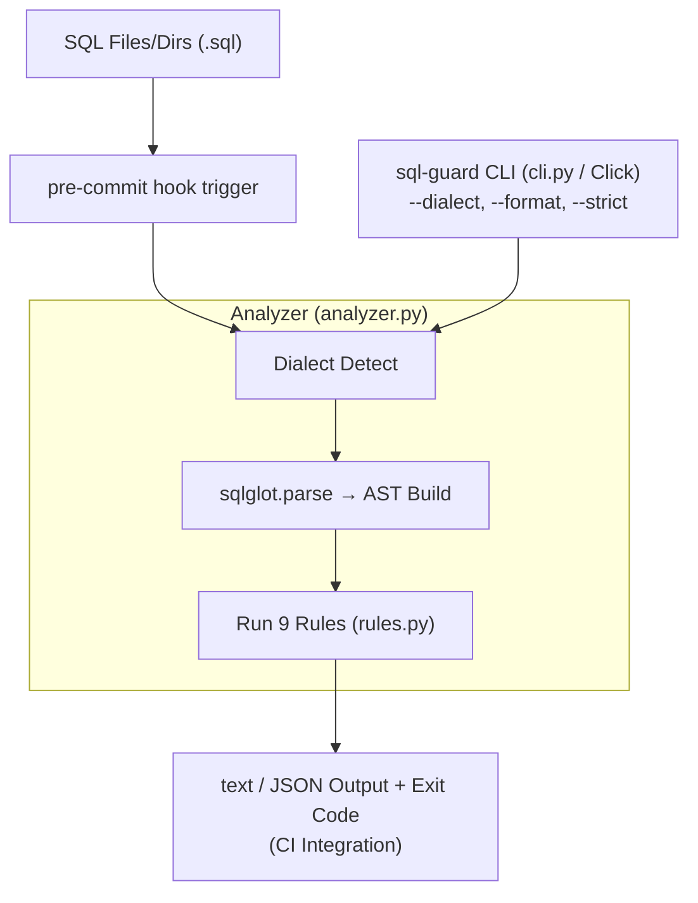

# SQL CI Static Guard

**sqlglot AST 기반 SQL 안티패턴 감지 CLI — cross-dialect 지원, pre-commit hook 통합**

- Category: Developer Tooling / Static Analysis
- Stack: Python, sqlglot, Click, uv
- Date: 2026-03-14

<!--
SQL 파일에 대한 정적 분석 도구를 하나 만들어봤다. 핵심은 sqlglot이라는 라이브러리의 AST를 활용해서 SQL 안티패턴을 감지하는 건데, 기존 도구들이 스타일 포맷팅에 집중하는 것과 달리 보안이나 성능 관점의 규칙에 초점을 맞췄다. pre-commit hook으로 CI에 바로 붙일 수 있게 만들었다.
-->

---

## Background

- SQL은 여전히 대부분의 서비스에서 데이터 접근의 핵심 언어
- 코드 리뷰에서 SQL은 "동작하면 넘어가는" 영역 — 정적 분석의 사각지대
- AI 코딩 도구가 SQL도 생성하는 시대, 생성된 SQL의 품질 검증은 사람 몫
- 기존 도구(SQLFluff)는 **스타일/포맷팅** 중심 — `SELECT *`, 하드코딩된 시크릿, WHERE 없는 DELETE 같은 **보안·성능 킬러**는 감지 못함

<!--
SQL은 좀 독특한 위치에 있다. 애플리케이션 코드는 ESLint든 Pylint든 정적 분석을 거치는데, SQL은 그런 게이트가 없다. 리뷰어가 직접 눈으로 보는 거다. 근데 SQL은 한 줄 실수로 테이블 전체가 날아갈 수 있다. WHERE 없는 DELETE 하나면 끝이다. 기존에 SQLFluff라는 도구가 있긴 한데, 이건 들여쓰기나 키워드 대소문자 같은 포맷팅에 집중한다. 보안이나 성능 관점의 검사는 빠져 있다.
-->

---

## Pain Point

커뮤니티에서 반복적으로 나오는 목소리:

| # | 출처 | Signal | Pain Point |
|---|------|--------|------------|
| 1 | Hacker News | ★★★ | SQL 파일의 보안/성능 문제를 배포 전에 잡는 정적 분석 도구가 CI에 통합되어 있지 않다 |
| 2 | r/programming | ★★★ | SELECT * 같은 성능 킬러가 리뷰를 통과해 프로덕션에 도달한다 |
| 3 | Hacker News | ★★★ | Snowflake, BigQuery, PostgreSQL 각각 다른 SQL 구문 — 도구가 dialect를 넘나들지 못한다 |

- 기존 대안: SQLFluff(스타일 전용), sqlcheck(2019년 업데이트 중단), Semgrep(SQL 미지원)

<!--
Hacker News나 Reddit에서 이 주제가 꾸준히 올라온다. SQL 변경사항이 코드 리뷰를 통과하는데, 거기서 SELECT *나 하드코딩된 비밀번호 같은 걸 못 잡는다는 거다. 또 하나는 dialect 문제다. PostgreSQL로 짠 쿼리와 Snowflake로 짠 쿼리가 문법이 다른데, 하나의 도구로 둘 다 검사할 수가 없다. 기존 도구들을 보면, SQLFluff는 포맷팅 전용이고, sqlcheck는 2019년에 멈췄고, Semgrep은 SQL을 제대로 지원 안 한다.
-->

---

## Solution

**한 줄 요약**: sqlglot의 AST 파싱 위에 보안·성능 규칙 엔진을 얹어, pre-commit hook 하나로 SQL 안티패턴을 배포 전에 차단한다.

**기존 도구와의 차이**:
- SQLFluff → 포맷팅 규칙 / **SQL Guard → 보안·성능 규칙**
- 단일 dialect 도구 → **cross-dialect 지원** (PostgreSQL, MySQL, Snowflake 동일 규칙)
- 별도 설정 → **pre-commit hook 한 줄 추가로 CI 통합**

**검증 목표**: pre-commit hook 하나 추가로 상위 안티패턴을 배포 전에 잡을 수 있는가?

<!--
접근법은 단순하다. sqlglot이라는 라이브러리가 SQL을 AST로 파싱해주는데, 이게 PostgreSQL이든 MySQL이든 Snowflake든 다 파싱한다. 그 AST 위에 보안·성능 관점의 규칙을 돌리는 거다. regex 매칭이 아니라 구문 트리를 탐색하는 방식이라 정확도가 높다. 결국 이건 "SQL 버전의 ESLint"를 만드는 건데, 포맷팅이 아니라 보안과 성능에 집중한다는 점이 다르다.
-->

---

## Architecture



- **rules.py**: 9 rule functions, each traversing AST nodes for pattern matching
- **analyzer.py**: file read → auto dialect detection → sqlglot parsing → rule execution
- **cli.py**: Click-based CLI, text/JSON output, `--strict` mode

<!--
구조는 세 파일이 전부다. rules.py에 9개 규칙 함수가 있고, 각 함수는 AST 노드를 순회하면서 안티패턴을 찾는다. analyzer.py가 SQL 파일을 읽고, 파일명이나 주석에서 dialect를 자동 감지한 다음, sqlglot으로 파싱하고 규칙을 실행한다. cli.py는 Click으로 만든 진입점이다. 전체 코드가 400줄 이하다. 규칙 하나를 추가하려면 함수 하나만 작성하면 되는 구조다.
-->

---

## Demo

```bash
$ uv run sql-guard samples/postgres_bad.sql

✗  samples/postgres_bad.sql [postgres]
   🟡 [select-star] Avoid SELECT *; explicitly list needed columns.
   🔴 [missing-where-delete] DELETE without WHERE clause will delete all rows.
   🔴 [missing-where-update] UPDATE without WHERE clause will update all rows.
   🟡 [leading-wildcard-like] LIKE '%widget%' uses a leading wildcard, preventing index usage.
   🟡 [implicit-column-order] INSERT without explicit column list relies on implicit column ordering.
   🔴 [hardcoded-credentials] Possible hardcoded credential: 'password ='
   🟡 [cartesian-join] CROSS JOIN produces a cartesian product — likely unintended.
   🟡 [order-by-ordinal] ORDER BY 2 uses ordinal position; use column name instead.
   🔴 [null-comparison] Use IS NULL / IS NOT NULL instead of = NULL / != NULL.

──────────────────────────────────────────────────
Files scanned: 1 | Violations: 11
```

- severity 구분: 🔴 error (즉시 수정) / 🟡 warning (권장)
- `--strict` 모드: warning 포함 전부 exit 1 → CI에서 블록

<!--
실제 출력이다. PostgreSQL 샘플 파일 하나를 넣었더니 11개 violation이 나온다. error는 빨간색, warning은 노란색으로 구분된다. WHERE 없는 DELETE 같은 건 error로 잡고, SELECT * 같은 건 warning으로 잡는다. CI에서는 --strict 플래그를 주면 warning도 포함해서 전부 실패 처리할 수 있다. 깨끗한 SQL 파일은 violation 0으로 통과한다.
-->

---

## Key Decisions & Lessons

**1. regex가 아니라 AST를 쓴 이유**
- regex로 `SELECT *`를 잡으면 주석이나 문자열 안의 것도 잡힌다
- AST 기반이면 `COUNT(*)`는 무시하면서 `SELECT *`만 정확히 감지 가능

**2. comma-join 감지의 함정**
- `FROM a, b`를 sqlglot이 implicit JOIN으로 파싱 → 단순 CROSS JOIN 체크로는 안 잡힘
- kind가 빈 문자열이고 ON/USING 없는 Join을 감지하도록 수정

**3. 심의 점수와 포지셔닝**
- 문제 진정성 3.3, 신선도 3.0 — "SQLFluff + Semgrep 조합으로 유사 효과" 반대 의견
- 프로토타입 적합성 4.3 — 빠르게 만들어서 검증하기엔 적합한 문제
- 차별점을 보안·성능 규칙 + cross-dialect 통합에 집중

<!--
기술 판단 몇 가지를 공유하면, 첫째로 regex 대신 AST를 쓴 건 정확도 때문이다. regex로 SELECT 뒤에 별표를 잡으면 주석 안의 것도 잡히고, COUNT(*)도 오탐이 난다. AST면 구문 구조를 알기 때문에 이런 문제가 없다. 둘째로, comma-join 감지가 좀 까다로웠다. FROM a, b 이런 문법을 sqlglot이 내부적으로 implicit JOIN으로 처리하는데, 단순히 CROSS JOIN만 찾으면 이걸 놓친다. 심의에서 신선도 점수가 3.0으로 낮았는데, 솔직히 맞는 지적이다. 다만 기존 도구 조합으로 이걸 하려면 설정이 꽤 복잡해서, 원클릭 통합이라는 점에서 차별점이 있다고 봤다.
-->

---

## Results & Future

### 성과 (5/5 완료 기준 통과)
- ✅ 3개 dialect (PostgreSQL, MySQL, Snowflake) 파싱 + AST 탐색
- ✅ 9개 안티패턴 규칙 구현 (목표 7개 초과)
- ✅ cross-dialect 동작 확인 — 동일 규칙이 dialect 무관하게 동작
- ✅ CLI text/JSON 출력 + exit code CI 연동
- ✅ pre-commit hook 자동 검사 (bad SQL 차단, clean SQL 통과)

### 한계
- ORM/동적 SQL 분석은 미지원 — 정적 `.sql` 파일만 대상
- auto-fix 기능 없음 — 감지만 하고 수정은 사람 몫
- SARIF 출력 미지원 — GitHub Code Scanning 연동은 추가 작업 필요

### 프로덕트가 되려면
- SARIF 출력 → GitHub Code Scanning 네이티브 연동
- YAML 기반 커스텀 규칙 정의 — 팀별 규칙 커스터마이징
- VS Code / JetBrains 플러그인 — IDE에서 실시간 피드백
- GitHub Action 마켓플레이스 배포

<!--
완료 기준 5개를 다 통과했다. 9개 규칙이 3개 dialect에서 잘 동작하고, pre-commit hook으로 커밋 시점에 자동으로 검사된다. 솔직히 한계도 명확한데, 정적 SQL 파일만 분석 가능하고 ORM이 생성하는 동적 쿼리는 못 본다. auto-fix도 없어서 문제를 알려주기만 하고 고쳐주진 않는다. 이걸 실제 프로덕트로 만들려면 SARIF 출력으로 GitHub Code Scanning에 붙이고, 팀별로 규칙을 커스터마이징할 수 있게 YAML 설정을 지원해야 한다. IDE 플러그인도 필요하다. 결국 이 프로토타입이 보여주려 한 건, SQL도 애플리케이션 코드처럼 정적 분석 게이트를 통과해야 한다는 것, 그리고 그게 꽤 간단하게 가능하다는 거다.
-->
